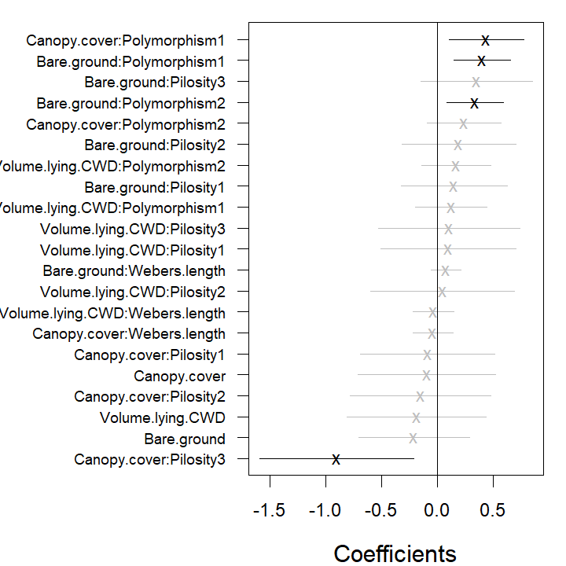
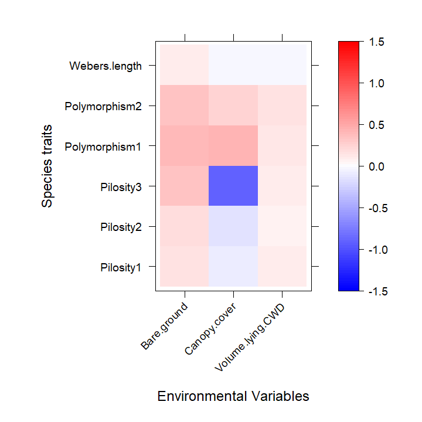

```{r setup, include = FALSE}
knitr::opts_chunk$set(
  collapse = TRUE,
  comment = "#>",
  warning = FALSE,
  fig.width=5, fig.height=5,
  fig.align = "center",
  dev = "png",
  fig.pos = 'H',
  code.frame=TRUE
)
```

This document illustrates the main features and functionality of the **gllvm** package, developed for the analysis of multivariate abundance data. Examples are provided in order to show how generalized linear latent variable models (GLLVM) can be applied to data. The functionality of the package is described in detail in  @Niku2019.

Multivariate abundance data, consisting of observations of multiple interacting species from a set of samples, are often collected in ecological studies to characterize a community or assemblage of organisms. The term "abundance" is taken here to mean counts, presence-absence records, biomass data or any other measure of the extent to which a species may be present at a site.

GLLVM extends the basic generalized linear model to multivariate data using a factor analytic approach, *i.e.* incorporating a small number of latent variables for each site accompanied by species specific factor loadings to model correlations between responses. These latent variables have a natural interpretation as ordination axes, but with additional capacity, *e.g.* predicting new values, controlling for known environmental variables, using standard model selection tools to choose number of ordination axes.

## Generalized linear latent variable models

A multivariate abundance dataset can be defined by a matrix of abundances, with $n$ rows (usually sites or samples) and $m$ columns of responses (usually species). Denote the abundance of the $j$th species at the $i$th site as $y_{ij}$. A set of k environmental variables, or experimental treatments, may also be recorded at each site and stored in the vector $\boldsymbol{x}_i = (x_{i1}, ..., x_{ik})$. A GLLVM regresses the mean abundance $\mu_{ij}$ against environmental variables and a vector of $d<m$ latent variables, $\boldsymbol{u}_i = (u_{i1}, ..., u_{id})'$:

$$g(\mu_{ij}) = \eta_{ij} = \alpha_i + \beta_{0j} + \boldsymbol{x}_i'\boldsymbol{\beta}_j + \boldsymbol{u}_i'\boldsymbol{\theta}_j,$$

where $\boldsymbol{\beta}_j$ and $\boldsymbol{\theta}_j$ are vectors of species specific coefficients related to the covariates and latent variables, respectively. The latent variables $\boldsymbol{u}_i$ can be thought of as unmeasured environmental variables, or as ordination scores, capturing the main axes of covariation of abundance (after controlling for observed predictors $\boldsymbol{x}_i$). We assume these latent variables are independent across sites and standard normally distributed. The parameters $\beta_{0j}$ are species specific intercepts, while $\alpha_i$ are optional community level row effects which can be chosen as either fixed or random effects ($\alpha_i \sim N(0; \sigma^2))$. If community level row effects for each sample $\alpha_i$ are included, all other terms in the model can be subsequently interpreted as modelling relative abundance or compositional effects (Hui et al., 2015).

If $q$ trait covariates $\boldsymbol{t}_j=(t_{i1}, \dots,t_{iq})^\top$ are also recorded, we can use them to help explain inter-specific variation in environmental response. This leads to an extension of the so-called "fourth corner model" where multivariate abundance is regressed against a function of traits and environment, and the environment-trait interactions represents the fourth corner association between traits and environment. We also include species-specific random slopes for environmental covariates in order to take into account the inters-pecific variation in responses that is not explained by the covariates. The associated fourth corner GLLVM then has mean model:

$$g(\mu_{ij}) = \eta_{ij}= \alpha_i + \beta_{0j} + \boldsymbol x^\top_i (\boldsymbol\beta_e + \boldsymbol b_j) + (\boldsymbol t_j \otimes \boldsymbol x_i)^\top \boldsymbol \beta_I + \boldsymbol u_i^\top\boldsymbol\theta_j,$$

where $\boldsymbol\beta_e$ is a vector of main effects for environmental covariates, and $\boldsymbol\beta_I$ are the fourth corner coefficients. A main effect for traits is not included, because main effects on abundance across species are absorbed by the intercept term $\beta_{0j}$. This model assumes that inter-specific variation in response to covariates is mediated by species and random slopes, which reduces the number of parameters related to covariates.

A difficulty fitting the GLLVM is that the $\boldsymbol{u}_i$'s are unobserved and we must integrate over their possible values. Specifically, the log-likelihood function we wish to maximize has the form
$$l(\boldsymbol\Psi)=\sum_{i=1}^n \log(f(y_{ij},\boldsymbol\Psi))=\sum_{i=1}^n \log\left(\int_{{\rm I\!R}^{d}} \prod_{j=1}^m f(y_{ij}|\boldsymbol u_i;\boldsymbol\Psi) f(\boldsymbol{u}_i) d\boldsymbol{u}_i,\right),$$

where $\boldsymbol\psi$ includes all model parameters. In this expression we have assumed abundances are independent across sites and any correlation across responses is captured by the latent variables $\boldsymbol u_i$. Thus conditional on $\boldsymbol u_i$, the $y_{ij}$ are independent of each other within sites.

The **gllvm** package overcomes these computational problems using three key innovations:

* maximizing an approximation to the log-likelihood that is (almost completely) closed form. We provide two ways to do this -- using Gaussian variational approximations for overdispersed counts, binary and ordinal responses, or using Laplace approximations for other exponential family distributions when a fully closed form variational approximation cannot be obtained *e.g.* biomass data can be modelled by the Tweedie distribution.

* Parameter estimation makes use of automatic differentiation software in C++ to accelerate computation times, via the interface provided by the R package TMB.

* Careful choice of starting values. In particular, we use a factor analysis on Dunn-Smyth residuals to obtain starting values close to the anticipated solution, optionally, with jittering to check the sensitivity of the approach.

In the next examples we illustrate the usage of the gllvm package using `antTraits` data from the `mvabund` package. The data consists of counts of 41 ant species measured at 30 sites across south-east Australia, along with records of five environmental variables and five trait variables for each species. The package and the data can be loaded as follows.
```{r}
library(mvabund)
library(gllvm)
data(antTraits)
y <- as.matrix(antTraits$abund)
X <- scale(as.matrix(antTraits$env))
TR <- antTraits$traits
```

## Data input

Main function of the **gllvm** package is `gllvm()`, which can be used to fit GLLVMs for multivariate data with the most important arguments listed in the following:
```{r, eval = FALSE}
gllvm(y = NULL, X = NULL, TR = NULL, data = NULL, formula = NULL, num.lv = 2, family, 
      method = "VA", row.eff = FALSE, offset = NULL, Power = 1.5, starting.val = "res", ...)
```

Data input can be specified using the "wide format" matrices via  `y`, `X` and `TR` arguments.

```{r, eval = FALSE}
# Model without predictors:
gllvm(y, family = "negative.binomial")
```

```{r, eval = FALSE}
# Model where environmental variables, that is, all variables in X are included:
gllvm(y, X, family = "negative.binomial")
```

```{r, eval = FALSE}
# Fourth corner model, where all main effects for environmental variables in X and
# all interactions between variables in X and variables in TR are included:
gllvm(y, X, TR, family = "negative.binomial")
```

An alternative way is to use the long format via `data` argument along with `formula`. Notice that `formula` can also be used for model specification when data is given in wide format. In the following lines the ant data is re-organised to  a long format.
```{r}
yX <- reshape(data.frame(cbind(y, X)), direction = "long", varying =
                colnames(y), v.names = "y", timevar = "sp")
TR2 <- data.frame(sp = 1:41, TR)
datalong <- merge(yX, TR2, by = "sp")
datalong[1:3, ]
```

The model can then be fitted as

```{r, eval = FALSE}
# Model without predictors:
gllvm(formula = y ~ 1, data = datalong, family = "negative.binomial")
```

```{r, eval = FALSE}
# Model with environmental variables Bare.ground and Shrub.cover as predictors
gllvm(formula = y ~ (Bare.ground + Shrub.cover), data = datalong,  
      family = "negative.binomial")
```

The number of latent variables can be defined using the argument `num.lv`. The default number of latent variables is two. Other important arguments in the `gllvm` call are `row.eff` for defining the type of row effects (none, fixed or random, or multiple and/or sructured via formula), `offset` for potential inclusion of offsets, `Power` for defining the power parameter of the Tweedie distribution and `starting.val` for judicious choice of starting values for the latent variables.

List of available distributions with the mean, $E(y_{ij})$, and mean-variance, $V(\mu_{ij})$, functions, estimation methods and link functions for various response types are in the table below.

| Response    | Distribution | Method  | Link  | Description                |
| ----------- |:------------:|:------- |:------- |:---------------------------|
|Counts  	    | Poisson 	   | VA/LA   |log	    | $E(y_{ij}) = \mu_{ij}$, $V(\mu_{ij})=\mu_{ij}$|
|             | NB    	     | VA/LA   |log		  | $E(y_{ij}) = \mu_{ij}$, $V(\mu_{ij})=\mu_{ij}+\phi_j\mu_{ij}^2$,|
|		          |		           |		     |		    | where $\phi_j>0$ is a dispersion parameter | 
|             | ZIP       	 | VA/LA   |log		  | $E(y_{ij}) = (1-p_j)\mu_{ij}$, $P(y_{ij}=0)=p_j$,|
|		          |		           |		     |		    | $V(\mu_{ij}) = \mu_{ij}(1-p_j) (1+\mu_{ij}p_j)$|
|             | ZINB       	 | VA/LA   |log		  | $E(y_{ij}) = (1-p_j)\mu_{ij}$, $P(y_{ij}=0)=p_j$,|
|		          |		           |		     |		    | $V(\mu_{ij}) = \mu_{ij}(1-p_j)(1+\mu_{ij}(p_j+\phi_j))$|
|             | binomial     | VA/LA   |probit  | $E(y_{ij}) = N_j\mu_{ij}$, $V(\mu_{ij}) = N_j\mu_{ij}(1-\mu_{ij})$|
|             | binomial     |    VA/EVA/LA   |logit   | 
|             | ZIB     | VA/LA   |probit  | $E(y_{ij}) = (1-p_j)N_j\mu_{ij}$, $V(\mu_{ij}) = N_j\mu_{ij}(1-p_j) (1+N_j\mu_{ij}p_j)$|
|             | ZIB     |    VA/EVA/LA   |logit   | 
|Binary       | Bernoulli 	 | EVA/VA/LA   |probit  | $E(y_{ij}) = \mu_{ij}$, $V(\mu_{ij}) = \mu_{ij}(1-\mu_{ij})$|
|             |              | EVA/LA 		 |logit   |                            |
|Biomass    	| Tweedie 	   | EVA/VA/LA  |log 	  | $E(y_{ij}) = \mu_{ij}$, $V(\mu_{ij}) = \phi_j\mu_{ij}^\nu$,|
|		          |		           |		     |		    | where $1<\nu<2$ is a power parameter and $\phi_j>0$ is a dispersion parameter |
|Ordinal 	    | Multinomial  | VA      |probit  | Cumulative probit model|
|Normal       | Gaussian     | VA/LA   |identity| $E(y_{ij}) = \mu_{ij}$, $V(y_{ij}) = \phi_j^2$|
|Positive continuous| Gamma     | VA/LA   |log| $E(y_{ij}) = \mu_{ij}$, $V(y_{ij}) = \mu_{ij}^2/\phi_j$|
|		          |		           |		     |		    | where $\phi_j$ is a shape parameter |
|Positive continuous | Exponential | VA/LA   |log| $E(y_{ij}) = \mu_{ij}$, $V(y_{ij}) = \mu_{ij}^2$|
|Percent cover| beta    	   | LA/EVA | probit/logit | $E(y_{ij}) = \mu_{ij}$, $V(\mu_{ij}) = \mu_{ij}(1-\mu_{ij})/(1+\phi_j)$ |
|Percent cover with zeros/ones| ordered beta    	   | EVA | probit | details in Korhonen et al (2024) |
|| beta hurdle    	   | EVA | probit | |
## Model-based ordination

GLLVMs can be used as a model-based approach to unconstrained ordination by including (*e.g.*) two latent variables in the model but no predictors. The corresponding ordination plot then provides a graphical representation of which sites are similar in terms of their species composition. Such a model can be fitted to the ant data using the function `gllvm` as below. We will consider two count distributions for the data -- the Poisson and negative binomial (NB).
```{r}
fitp <- gllvm(y, family = poisson())
fitp
```

```{r}
fit_ord <- gllvm(y, family = "negative.binomial")
fit_ord
```
As a model-based ordination method, GLLVMs offer tools for the model checking in contrast to the classical algorithm-based ordination methods such as nMDS. For example, the default printout above includes information criteria, which all suggest that the NB distribution is a better choice than the Poisson distribution for modelling the response.

In addition to information criteria, we can use residual plots for diagnosing model fit. As a default, `plot` function utilizes `residual` function to calculate Dunn-Smyth residuals, also known as randomized quantile residuals, and then prints five residual diagnostic plots, including a plot of residuals against linear predictors of fitted values, a Normal Q-Q plot of residuals with a simulated point-wise 95\% confidence interval envelope, residuals against row index and column index and scale-location plot. With an argument `which` one can define which plots will be produced. 

The residual diagnostics below for the Poisson model shows some overdispersion in residuals, in particular, a telltale fan-shape in the plot of residuals against fitted values. These issues are largely resolved in the NB model. Note that the latent variables in the model provide some capacity to account for overdispersion, so overdispersed counts do not always require us to move beyond the Poisson distribution, although there is clear evidence of such a need in this example. 

```{r, fig.show='hold'}
# Plot residuals for the Poisson model
par(mfrow = c(3, 2), mar = c(4, 4, 2, 1))
plot(fitp, var.colors = 1)
```

```{r, fig.show='hold'}
# Plot residuals for the NB model
par(mfrow = c(3, 2), mar = c(4, 4, 2, 1))
plot(fit_ord, var.colors = 1)
```

Once an appropriate model has been established for the data, we can construct an ordination as a scatter plot of the predicted latent variables via the `ordiplot` function. The species with the largest factor loadings (largest norms, $||\boldsymbol\theta_j||$), and hence most strongly associated with ordination scores, can be added using the logical argument `biplot`, leading to a biplot for finding indicator species corresponding to specific sites. The `ind.spp` argument defines the number of species to be plotted. 

The command below creates the biplot and the ordination plot based on the GLLVM fitted to the `antTraits` data. We can see one large cluster of sites on the top with many indicator species, and few smaller clusters with only few indicator species *e.g.* sites 12--15. 95% prediction regions in the ordiplot give some clue of the uncertainty of the estimates. The rotation and scale of the latent variables and loadings below differ from the actual values as in order to produce the biplot the predicted latent variables and their loadings are rotated and scaled so that the factor loadings of the species are in the same direction with the sites where they are most abundant.

```{r, fig.show='hold', out.width='70%'}
ordiplot(fit_ord, biplot = TRUE, ind.spp = 15, xlim = c(-3, 3), ylim = c(-3, 3), 
         main = "Biplot")
ordiplot(fit_ord, biplot = FALSE, ind.spp = 15, xlim = c(-3, 3), ylim = c(-3, 3), 
         main = "Ordination plot", predict.region = TRUE)
```

Sometimes species names in the biplot might be hard to read, especially when species names are long or if they are close to each other. In order to make the figure easier to read we can change the sizes of the species names in the biplot using `cex.spp`. If species or site names are too close to each other we can use `jitter = TRUE` in order to add some random variation in the species and site locations. We can also shorten the species names. This can also be done after the model is fitted by directly changing the row names in the loading matrix, see the example below.

```{r, fig.show='hold', out.width='70%'}
rownames(fit_ord$params$theta) <- paste("spp", 1:ncol(fit_ord$y), sep = "")
ordiplot(fit_ord, biplot = TRUE, ind.spp = 15, xlim = c(-3, 3), ylim = c(-2, 1.6), 
         main = "Biplot", jitter = TRUE, cex.spp = 0.8)
```


## Model with environmental variables

Environmental variables can be included in the model, whether to study their effects on assemblages, or to study patterns of species co-occurrence after controlling for environmental variables. We illustrate here this model by including three environmental variables `Bare.ground`, `Canopy.cover` and `Volume.lying.CWD` to the model. Similarly to previous example, we can use residual analysis and information criteria to study which distribution offers the most suitable mean-variance relationship for the responses, and how many latent variables are needed.
```{r, eval = FALSE, warning = FALSE}
criteria <- NULL
for(i in 1:5){
  fiti <- gllvm(y, X, family = "negative.binomial", num.lv = i, sd.errors = FALSE,
                formula = ~ Bare.ground + Canopy.cover + Volume.lying.CWD, seed = 1234)
  criteria[i] <- summary(fiti)$AICc
  names(criteria)[i] = i
}
```

```{r, eval = FALSE, warning = FALSE}
# Compare AICc values
criteria
#>        1        2        3        4        5 
#> 4163.565 4215.446 4311.091 4462.069 4612.805
```

Based on these tools a model with NB distributed responses and 1 latent variable was chosen.

```{r, warning = FALSE}
fit_env <- gllvm(y, X, family = "negative.binomial", num.lv = 1,
                 formula = ~ Bare.ground + Canopy.cover +
                   Volume.lying.CWD, seed = 1234)
```

The estimated coefficients for predictors and their confidence intervals can be plotted using the `coefplot` function, in order to study the nature of effects of environmental variables on species. Function `coefplot` plots the point estimates (ticks) for coefficients of the environmental variables and their 95\% confidence intervals (lines) for the `fit_env` model, with those colored in grey (black) denoting intervals (not) containing zero.
```{r, fig.show='hold', out.width='49%'}
coefplot(fit_env, cex.ylab = 0.7, mar = c(4, 9, 2, 1), mfrow=c(1,1))
```

In the resulting plot above most of the 95\% confidence intervals include zero, indicating that the majority of the species do not exhibit evidence of a strong association between environment and species abundance. This may be due to a lack of information in the data, as much as being due to a lack of environmental association after accounting for potential residual species covariation. The extreme effect sizes of covariates `Canopy.cover` and `Volume.lying.CWD` are explained by the fact that species `Myrmecia.pilosula.complex` and `Ochetellus.glaber` were observed only in sites where percent canopy cover was zero and species `Cardiocondyla.nuda.atalanta` was observed mainly on sites where estimated volume of Coarse Woody Debris was zero and only once in other sites. Due such lack of variation the effects sizes tend to become extreme.

Similarly to the biplot, the species names in the coefficient plot can also be changed by changing the row names in the coefficient matrix. Species ordering according to the effects' sizes is optional with logical argument `order`.
```{r, fig.show='hold', out.width='49%'}
rownames(fit_env$params$Xcoef) <- paste("spp", 1:ncol(fit_env$y), sep = "")
coefplot(fit_env, cex.ylab = 0.7, order = FALSE, mfrow=c(1,1))
```

```{r, echo=FALSE}
rownames(fit_env$params$Xcoef) <- colnames(fit_env$y)
```

Alternatively, model-selection on covariates, latent variables or both can be performed by dredging, using the MuMIn package. Though especially for large datasets with many covariates and latent variables, this can take a while to run.
```{r, eval = FALSE, warning = FALSE}
library(MuMIn)
fit_table <- dredge(fiti,varying=list(num.lv=1:5), rank="AICc")
subset(fit_table, delta<2)
# Global model call: gllvm(y = y, X = X, formula = ~Bare.ground + Canopy.cover +  Volume.lying.CWD, 
#     family = "negative.binomial", num.lv = i, sd.errors = FALSE, 
#     seed = 1234)
# ---
# Model selection table 
#    (Int) Cnp.cvr num.lv  df    logLik   AICc delta weight
# 11     +       +      1 164 -1839.914 4058.6     0      1
# Models ranked by AICc(x) 
```

## Studying co-occurrence patterns

Latent variables induce correlation across response variables, and so provide a means of estimating correlation patterns across species, and the extent to which they can be explained by environmental variables. Information on correlation is stored in the factor loadings $\boldsymbol\theta_j$, so the residual covariance matrix, storing information on species co-occurrence that is not explained by environmental variables, can be calculated as $\boldsymbol\Sigma=\boldsymbol\Gamma \boldsymbol\Gamma^\top$, where $\boldsymbol\Gamma = [\boldsymbol\theta_1\dots\boldsymbol\theta_m]'$. The `getResidualCor` function can be used to estimate the correlation matrix of the linear predictor across species. This can be visualised using the `corrplot` package:

```{r, fig.show='hold'}
# Residual correlation matrix:
cr <- getResidualCor(fit_env)
library(corrplot); library(gclus)
```

```{r, fig.show='hold'}
corrplot(cr[order.single(cr), order.single(cr)], diag = FALSE, type = "lower", 
         method = "square", tl.cex = 0.5, tl.srt = 45, tl.col = "red")
```

Group of squares coloured in dark blue in correlation plot indicate clusters of species that are positively correlated with each other, after controlling for (co)variation in species explained by environmental terms in `fit_env` (which had linear terms for `Bare.ground`, `Canopy.cover` and `Volumn.lying.CWD`). There are also group of squares coloured in red, indicating negative correlation between pairs of species. The effect of the environmental variables on the between species correlations can be seen by comparing the residual correlation matrix (above) to the correlation matrix given by the model without environmental variables (below). 

```{r, warning=FALSE}
# Fit GLLVM without environmental variables and 1 latent variable:
fit1lv <- gllvm(y, family = "negative.binomial", num.lv = 1, seed = 1234)
```

```{r, fig.show='hold', warning=FALSE}
# Correlation matrix
cr0 <- getResidualCor(fit1lv)
corrplot(cr0[order.single(cr0), order.single(cr0)], diag = FALSE, type = "lower", 
         method = "square", tl.cex = 0.5, tl.srt = 45, tl.col = "red")
```

Residual correlations can also be visualized in a residual biplot, where highly correlated species tend to lie in the same direction and negatively correlated species at the opposite side of the biplot, see figure (b) below. In order to do that we fit the `fit_env` model with two latent variables and compare it to the model without predictors `fit_ord` (a).

```{r fig.height=7, fig.show='hold', fig.width=7, message=FALSE, warning=FALSE, out.width='49%'}
fit_env2 <- gllvm(y, X, family = "negative.binomial", num.lv = 2, 
                  formula = ~ Bare.ground + Canopy.cover + 
                    Volume.lying.CWD, seed = 12345)
rownames(fit_env2$params$theta) <- paste("sp", 1:ncol(fit_env2$y), sep = "")
ordiplot(fit_ord, biplot = TRUE, ind.spp = 15, jitter = TRUE, cex.spp = 1,
         xlim = c(-4, 3.5), ylim = c(-2.5, 2), main = "(a)")
ordiplot(fit_env2, biplot = TRUE, ind.spp = 15, jitter = TRUE, cex.spp = 1,
         xlim = c(-4, 3.5), ylim = c(-2.5, 2), main = "(b)")
```

In both biplots we can see that species 23 (Monomorium.rothsteini), 24 (Monomorium.sydneyense), 28 (Nylanderia.sp..A) and 41 (Tetramorium.sp..A) are close to each other. This can also be seen in the correlation plots as their between species correlations are highly positive.

The `getResidualCov` function can be used to quantify the amount of variation in the data that can be explained by environmental variables. Specifically, if we use the trace of the residual covariance matrix $\boldsymbol\Sigma$ as a measure of unexplained variation, then we can compare this quantity before and after environmental variables are included in the model. The ratio of traces suggests that environmental variables explain approximately 40\% of the (co)variation in ant species abundances.

```{r}
rcov <- getResidualCov(fit_env, adjust = 0)
rcov0 <- getResidualCov(fit1lv, adjust = 0)
rcov0$trace; rcov$trace
1 - rcov$trace / rcov0$trace
```


## Incorporating functional traits into fourth corner models

In the previous section, environmental associations were studied by fitting separate terms for each species, without attempting to explain why different species respond differently to the environment. Adding functional traits to the model offers the potential to explain why species differ in environmental response. 


The fourth corner model can be fitted using the argument `TR` to include traits. The argument `formula` is used to specify the model. Community level random row effects are included using `row.eff = "random"` and the argument `randomX` is used to incorporate random slopes in the model. As the defined model is very complex, we use three starting points for the initial values of the latent variables via argument `n.init` in order to ensure that the maximum point is reached.

```{r, warning=FALSE, eval = FALSE}
fit_4th <- gllvm(y, X, TR, family = "negative.binomial", num.lv = 1, 
                 formula = y ~ (Bare.ground + Canopy.cover + Volume.lying.CWD) +
                (Bare.ground + Canopy.cover + Volume.lying.CWD) : (Pilosity + 
                Polymorphism + Webers.length), seed = 123,
                row.eff = "random", control.start =list(n.init = 3, jitter.var = 0.01),
                randomX = ~ Bare.ground + Canopy.cover + Volume.lying.CWD)
```

As previously, coefficients can be plotted using the function `coefplot`. The environmental-trait interaction terms, also known as the fourth corner terms, can be visualized using the function `levelplot` from the package `lattice`, see below. The resulting plots indicate that interactions of the trait variable `Polymorphism` with `Bare.ground` and `Canopy.cover`, `Pilosity3` with `Canopy.cover` have the strongest effects on ant abundances.
```{r, echo=FALSE, warning = TRUE, eval = FALSE}
load(file = "fit_4th.Rdata")
```
```{r F4, fig.show='hold', out.width='49%', warning = TRUE, eval = FALSE, echo=TRUE}
library(lattice)
coefplot.gllvm(fit_4th, mar = c(4, 11, 1, 1), cex.ylab = 0.8)
fourth <- fit_4th$fourth.corner
a <- 1.5
colort <- colorRampPalette(c("blue", "white", "red"))
plot.4th <- levelplot((as.matrix(fourth)), xlab = "Environmental Variables", 
                      ylab = "Species traits", col.regions = colort(100), cex.lab = 1.3, 
                      at = seq(-a, a, length = 100), scales = list(x = list(rot = 45)))
plot.4th
```
<div class="figure" style="text-align: center">

<p class="caption"> coefplot</p>
</div>

<div class="figure" style="text-align: center">

<p class="caption"> fourth corner plot</p>
</div>


## Example: Model-based inference

A key point of departure in the `gllvm` package, as compared to alternative ways to fit GLLVMs, is that by using a maximum likelihood framework, likelihood-based machinery becomes available for inference. A particular example is likelihood ratio testing, available via the `anova` function when comparing nested models. It should be noted however that such tests can only be expected to maintain (close to) valid Type I error rates when the number of parameters involved in the model is small (they rely on large-$N$-small-$m$ asymptotics).

In the previous example, trait-environment interactions seem to be relatively small and most of the confidence intervals include zero values. Using a likelihood ratio test we can test if the traits vary with environment. Below, the model without traits is fitted and the likelihood ratio test comparing this model to the previous one is performed. Based on the output when applying the `anova` function, the $p$ value suggests that the fourth corner model with interactions is more appropriate. Notice that in order to separate the model with only main effects for environmental variables from the one which has species specific coefficients for environmental variables, we include `TR` matrix to the function call.
```{r, warning=FALSE, eval=FALSE}
fit_4th2 <- gllvm(y, X, TR, family = "negative.binomial", num.lv = 1, 
        formula = y ~ (Bare.ground + Canopy.cover + Volume.lying.CWD), seed = 123,
                 row.eff = "random", control.start =list(n.init = 3, jitter.var = 0.01),
                 randomX = ~ Bare.ground + Canopy.cover + Volume.lying.CWD)
# Test interactions using likelihood ratio test:
anova(fit_4th, fit_4th2)
# Model  1 :  y ~ (Bare.ground + Canopy.cover + Volume.lying.CWD) 
# Model  2 :  y ~ (Bare.ground + Canopy.cover + Volume.lying.CWD) + (Bare.ground + 
# Canopy.cover + Volume.lying.CWD):(Pilosity + Polymorphism + Webers.length) 
# Resid.Df        D Df.diff     P.value
# 1     1097  0.00000       0            
# 2     1079 61.26473      18 1.27598e-06
```


# References

---
references:
- id: Niku2019
  title: gllvm - Fast analysis of multivariate abundance data with generalized linear latent variable models in R.
  author: 
  - family: Niku
    given: J.
  - family: Hui
    given: F.K.C.
  - family: Taskinen
    given: S.    
  - family: Warton
    given: D.I.
  publisher: Methods in Ecology and Evolution
  volume: 10
  page: 2173-2182
  type: article-journal
  issued:
    year: 2019

---
