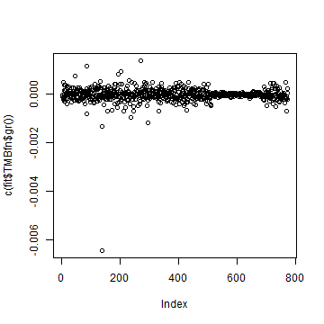
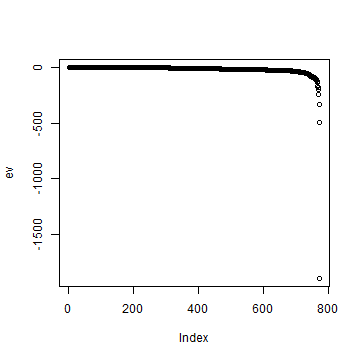
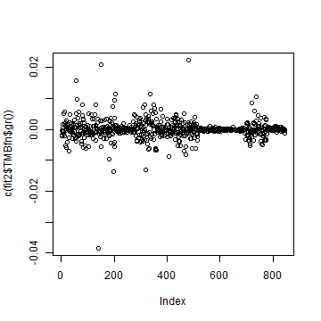
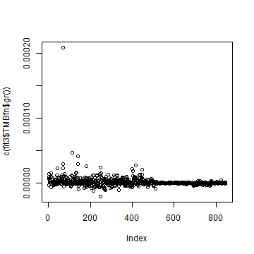
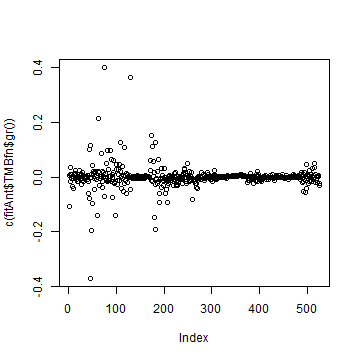
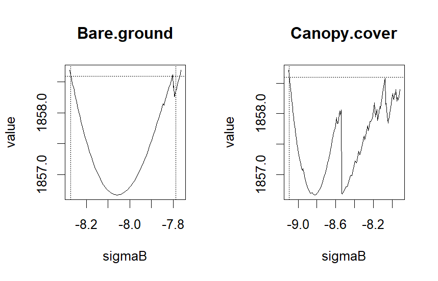

In this vignette, we demonstrate how to assess the convergence of a gllvm model. When fitting GLLVMs using gllvm, as well as with any method with any package, assessing convergence is essential to ensure reliable inference. The model need to be well converged so that the estimated parameter values are reliable and that the principles of Maximum Likelihood (ML) inference can be validly applied. We also show what steps can be taken if the initial model fails to converge.

## How Convergence Is Assessed in Maximum Likelihood Estimation

When fitting a generalized linear latent variable model (GLLVM) using maximum likelihood (ML) estimation, the optimization algorithm iteratively searches for parameter values that maximize the log-likelihood. Convergence refers to the point at which the algorithm stops because it has (ideally) located a stable maximum.

In ML estimation, convergence is typically assessed using several criteria:

* Gradient conditions: At the optimum, the gradient of the log-likelihood with respect to the parameters should be close to zero. Large gradients indicate that the algorithm stopped before reaching a maximum.

* Hessian matrix: The Hessian matrix at the optimum should be negative definite, indicating that the algorithm found a local maximum rather than a saddle point. Non‑definite Hessians often signal incomplete convergence or identification problems.

* Parameter stability: Parameter estimates should be reasonable and not lie at theoretical boundaries (e.g., variance parameter = 0).

* Iteration behavior: The log-likelihood should ideally increase smoothly and stabilize as iterations proceed. Irregular jumps or oscillation may be a sign of instability in the optimization process. This can happen when the likelihood surface is difficult (non‑convex or with sharp curvature,  multimodality, flat), the gradient or Hessian is poorly behaved or the initial values are far from the optimum.

Next we present some tools on how we can asses the convergence for gllvm models.

## Assessing Convergence for a GLLVM 

Below we demonstrate how to assess convergence using the gllvm package. Let's first fit a model that we can demonstrate these things.


``` r
library(gllvm)
# Example dataset
data(beetle)
y<-beetle$Y
X<- beetle$X
X[,unlist(lapply(X, is.numeric))] = scale(X[,unlist(lapply(X, is.numeric))])
TR <- beetle$TR
TR[,unlist(lapply(TR, is.numeric))] = scale(TR[,unlist(lapply(TR, is.numeric))])

fit <- gllvm(y = y,  X = X, formula = ~Management, family = "negative.binomial",  num.lv = 2, seed = 123)
```


**Gradient values**: Near-zero values suggest convergence.
Gradient function for the fitted model can be obtained with `fit$TMBfn$gr()`. Gradient values can be checked, for example, visually like below:

``` r
plot(c(fit$TMBfn$gr()))
```

<div class="figure" style="text-align: center">

<p class="caption">plot of chunk grad1</p>
</div>

From the figure we can see that all gradients are close to zero, now $<0.01$ suggesting that model is converged.

**Hessian matrix condition**: Hessian $H(log L(\hat{\boldsymbol \theta}))$ for log likelihood should be negative definite so that $log L$ is a concave surface around $\hat{\boldsymbol \theta}$. That is, negative hessian $- H(log L(\hat{\boldsymbol \theta}))$ should then be positive definite and invertible, so that standard errors can be computed reliably and variances are positive, as $Cov(\hat{\boldsymbol \theta}) = \[- H(log L(\hat{\boldsymbol \theta}))\]^{-1}$. **Note that, in gllvm we find the maximum by minimizing the negative log-likelihood so then things flip around and we straight get negative Hessian $H(- log L(\hat{\boldsymbol \theta})) = - H(log L(\hat{\boldsymbol \theta}))$, which should be positive definite. Or alternatively, we need to multiply it with minus like below.**

Let's check concavity of likelihood with the Hessian


``` r
# If standard errors were calculated, negative hessian is
# already calculated and can be extracted, but for definiteness checks take minus to get Hessian:
H <- - fit$Hess$Hess.full
```


``` r
# But if SEs not yet calculated, for method ="VA" and method ="EVA":
H <- - fit$TMBfn$he(fit$TMBfn$par)
# And if model is fitted with method = "LA"
H <- - optimHess(fit$TMBfn$par, fit$TMBfn$fn, fit$TMBfn$gr)
```

There are number of ways to check for negative definiteness. Some ways are more robust than others but here we present a couple of ways. In numerical optimization process, small numerical inaccuracies in Hessian due rounding errors, small non‑symmetries, or near‑singularity, are common so we can use a couple of different ways like eigenvalues or cholesky factorization as a test for negative definiteness.

First, we can check if matrix is negative definite by seeing if all eigenvalues are negative:


``` r
# Symmetrize H1 explicitly, as even  tiny asymmetries can cause definiteness tests to fail:
Hsym <- 0.5 * (H + t(H))
# Calculate eigenvalues and check sign:
ev <- eigen(Hsym, symmetric = TRUE)$values
all(ev < 0)
#> [1] TRUE
max(ev)
#> [1] -0.003032225
plot(ev)
# All eigenvalues are negative -> Hessian is negative definite
```

<div class="figure" style="text-align: center">

<p class="caption">plot of chunk eigencheck</p>
</div>

One numerically stable check is to check definiteness by attempting to apply cholesky factorization to negative Hessian, which should succeed when Hessian is negative definite/ negative Hessian is positive definite.


``` r
tryCatch(
  CHf <- chol(-Hsym),
  error = function(e) "Not negative definite"
)
# Cholesky factorization succeeded so -H is positive definite and thus Hessian is negative definite
```

If the Hessian is almost negative definite, but not exactly only due rounding errors and other numerical reasons, one can evaluate it with function `nearPD` from *Matrix* package to find the closest positive semidefinite matrix for minus Hessian and then compare it.


``` r
library(Matrix)
# Find nearest positive semidefinite matrix for -Hsym:
nH_corrected <- nearPD(-Hsym)$mat
range(-Hsym - nH_corrected)
# Hessian is negative definite and likelihood is concave
```

On default, gllvm calculates standard errors, and checks if Hessian is invertible. If standard error calculation does not succeed, it indicates that there is a problem. 

In addition to these checks, we also encourage to check that parameter estimates and standard errors seems reasonable. For example, theoretically extreme parameter values and standard errors of zero may be an indication of poor model fit.

Below we take a look at the estimated parameters and standard errors for the fitted model *fit*. Parameters look reasonable. There are few coefficients that seem a bit extreme, which can be due low number of observations of some species in this data. Also, standard errors look reasonable (note that upper diagonal of theta is fixed, that is the reason for exact zeros in their sd's).


``` r
fit$params
#> $theta
#>                   LV1         LV2
#> agonfuli  1.000000000  0.00000000
#> agonmuel  0.837767809  1.00000000
#> amaraene  0.461520371 -1.28403440
#> amarapri  0.078103590  2.50729849
#> amarauli  0.181730803  1.42494621
#> amarbifo  0.716034252  3.28828304
#> amarcomm  0.278302702  1.77946330
#> amareury  0.147034359  1.92333736
#> amarfami -0.121039949  0.90831527
#> amarluni  0.002883691  1.61929358
#> amarpleb  0.770673851  2.15960961
#> anchdors -0.031944657  1.17663470
#> asapflav  0.705425516  0.72357509
#> bembaene  1.575409055  1.19604363
#> bembbrux  0.141876329 -2.20545819
#> bembgutt  0.621979991  0.40756937
#> bemblamp  0.245578965  0.37753683
#> bembmann  0.726773451  0.02570166
#> bembobtu  0.172296874  3.15882345
#> bembtetr  0.577069524 -0.68359216
#> bradharp  0.191529366 -0.38062728
#> bradrufi -0.567384489 -0.86966837
#> calafusc  0.144091494  3.33288249
#> calamela -0.214518937  0.65156832
#> calamicr -0.480248524 -0.11038005
#> caraarve -0.713948459  1.58010693
#> caraglab -0.626429386 -0.46623647
#> caragran -0.097448255 -0.01836506
#> caranemo -0.359903625  2.85922859
#> caranite -0.627975026  1.31793747
#> caraprob -0.605394774  0.64526095
#> caraviol -0.342411182  0.29384530
#> clivfoss  0.452334244  0.30322183
#> cychcara  0.114943625  0.81193647
#> dyscglob  0.543391909 -1.66057583
#> elapcupr  0.750205614 -0.87840418
#> elapulig  0.530645224 -1.79632725
#> harpaffi -0.107102982  0.31762279
#> harplatu -0.425130389  1.42817642
#> harprufi  0.253055048  1.74962991
#> leisterm -0.074810741  0.04680055
#> loripili  0.475171678  0.34968156
#> nebrbrev  0.772912144  1.82319018
#> nebrsali -0.577595596  0.91388581
#> notiaqua -0.648224660  0.80928218
#> notibigu -0.242528279  1.09654234
#> notigerm -0.625992869  0.32927085
#> notipalu -0.166903862  1.65042451
#> notisubs  0.581380447  2.95748497
#> olisrotu -0.533203128  0.76391253
#> patrassi -0.197514593  1.34509973
#> patratro  1.558888457  2.83128458
#> poecvers -0.192959022  0.07267955
#> pteradst -1.001582894  0.95929776
#> pterdili  0.057125952  0.47637736
#> ptermadi -0.355033129  3.30668790
#> ptermela  0.554313568  1.05429302
#> pternige  0.228400382  1.31080262
#> pternigr  0.656075177  0.22144698
#> pterrhae -0.011308295 -0.22917531
#> pterstre  0.924358441 -0.03019306
#> ptervern  0.849231600 -0.63850121
#> stompumi  0.460615090  2.91006622
#> synuviva  0.280867819  2.35282600
#> trecmicr  0.979401881 -0.89955321
#> trecobtu  0.166596963 -1.65141079
#> trecquad  0.309475759  0.61706911
#> trecrube  0.792462957 -0.14490312
#> 
#> $sigma.lv
#>       LV1       LV2 
#> 2.0729210 0.7131871 
#> 
#> $beta0
#>    agonfuli    agonmuel    amaraene    amarapri    amarauli    amarbifo 
#> -2.91073202  1.58112716 -2.07439516 -1.67963948 -1.43553497 -1.73012130 
#>    amarcomm    amareury    amarfami    amarluni    amarpleb    anchdors 
#>  0.08970574 -3.16706102  0.05743325 -0.46608313  2.07730443 -0.14664634 
#>    asapflav    bembaene    bembbrux    bembgutt    bemblamp    bembmann 
#> -3.70767302 -0.33260108 -2.96470608  1.70209373  2.12128204 -2.08629120 
#>    bembobtu    bembtetr    bradharp    bradrufi    calafusc    calamela 
#> -2.40249604 -1.85126302 -0.89679161 -3.49478242  3.58726959  3.52645228 
#>    calamicr    caraarve    caraglab    caragran    caranemo    caranite 
#> -2.91022436 -4.01549888 -3.68720013 -3.42244083 -1.41559816 -8.04594125 
#>    caraprob    caraviol    clivfoss    cychcara    dyscglob    elapcupr 
#> -0.41666795 -0.80609887  2.67763171 -2.40658536 -3.23299718 -2.53174440 
#>    elapulig    harpaffi    harplatu    harprufi    leisterm    loripili 
#> -7.75271612 -2.36776491 -2.00120806 -1.10011343 -0.89263253  3.24998845 
#>    nebrbrev    nebrsali    notiaqua    notibigu    notigerm    notipalu 
#>  3.57141570  0.93381837 -1.24751985  1.33004510 -3.88623566 -6.92178651 
#>    notisubs    olisrotu    patrassi    patratro    poecvers    pteradst 
#> -0.83080602 -2.59339386 -3.21741489 -2.40963672  0.23113332 -2.40962605 
#>    pterdili    ptermadi    ptermela    pternige    pternigr    pterrhae 
#> -0.48400125  3.04437825  3.19084557  3.06431646  0.30255616 -0.66058392 
#>    pterstre    ptervern    stompumi    synuviva    trecmicr    trecobtu 
#>  1.04373473 -1.27602074 -2.57674684  0.04435503 -1.70126603  1.64619177 
#>    trecquad    trecrube 
#>  2.49510657 -3.82404713 
#> 
#> $Xcoef
#>           Management
#> agonfuli -2.43731936
#> agonmuel  1.64443222
#> amaraene  0.90065500
#> amarapri  2.43202829
#> amarauli -0.14794434
#> amarbifo  1.96522311
#> amarcomm -0.59375431
#> amareury  1.45758361
#> amarfami  1.07782921
#> amarluni -0.52583279
#> amarpleb  1.71406938
#> anchdors  2.81110126
#> asapflav  0.74755647
#> bembaene  3.65701131
#> bembbrux  2.23376557
#> bembgutt  1.74563985
#> bemblamp  1.30498873
#> bembmann -0.02356087
#> bembobtu  3.36192285
#> bembtetr  3.48605441
#> bradharp -0.92032005
#> bradrufi -0.73069630
#> calafusc  1.35864169
#> calamela  0.96035027
#> calamicr -3.49218999
#> caraarve -3.45182204
#> caraglab -2.39071026
#> caragran -3.86123107
#> caranemo  0.32017458
#> caranite -6.41717862
#> caraprob -2.35664566
#> caraviol -1.80873999
#> clivfoss  1.02224294
#> cychcara -2.55055458
#> dyscglob -3.28912305
#> elapcupr -0.96332973
#> elapulig -5.68035166
#> harpaffi  0.83431319
#> harplatu -2.00988924
#> harprufi  2.12116557
#> leisterm -2.21113138
#> loripili  0.67878804
#> nebrbrev  1.36536418
#> nebrsali -1.34551499
#> notiaqua -1.56634130
#> notibigu  0.40811840
#> notigerm -1.98757464
#> notipalu -4.37055372
#> notisubs  1.28342071
#> olisrotu -0.48989968
#> patrassi -4.98435964
#> patratro  1.23495587
#> poecvers -1.51453820
#> pteradst -1.49724554
#> pterdili -2.43306442
#> ptermadi -0.37431865
#> ptermela  2.00555529
#> pternige  0.61911357
#> pternigr -0.72646922
#> pterrhae -3.05794923
#> pterstre  0.26197204
#> ptervern  0.15484745
#> stompumi  1.33348458
#> synuviva  1.59550154
#> trecmicr  1.48983921
#> trecobtu -0.40960327
#> trecquad  2.68172282
#> trecrube -0.59971827
#> 
#> $inv.phi
#>   agonfuli   agonmuel   amaraene   amarapri   amarauli   amarbifo   amarcomm 
#> 0.07961679 0.48524148 0.10686970 0.51439659 0.05394490 0.14244615 0.43898903 
#>   amareury   amarfami   amarluni   amarpleb   anchdors   asapflav   bembaene 
#> 0.28759639 0.43164789 0.25655062 0.46344707 0.53159377 0.40347207 0.12581791 
#>   bembbrux   bembgutt   bemblamp   bembmann   bembobtu   bembtetr   bradharp 
#> 0.11894098 0.31884436 0.24946745 0.03530924 0.07694324 0.31186033 0.10844062 
#>   bradrufi   calafusc   calamela   calamicr   caraarve   caraglab   caragran 
#> 0.50165987 0.14115254 0.18420272 0.09709385 0.23345485 0.69887227 0.11265257 
#>   caranemo   caranite   caraprob   caraviol   clivfoss   cychcara   dyscglob 
#> 0.06580549 0.10623581 0.63418710 0.24016392 0.69219547 0.27109900 0.04552533 
#>   elapcupr   elapulig   harpaffi   harplatu   harprufi   leisterm   loripili 
#> 0.13297943 0.11178892 0.46558267 0.39283339 0.30213901 0.11923631 0.94302491 
#>   nebrbrev   nebrsali   notiaqua   notibigu   notigerm   notipalu   notisubs 
#> 0.92102198 0.16100455 0.36770102 0.60749524 0.30358476 0.31078514 0.19620504 
#>   olisrotu   patrassi   patratro   poecvers   pteradst   pterdili   ptermadi 
#> 0.10935610 0.23862073 0.09761954 0.04934841 0.22127126 0.17938607 0.38606473 
#>   ptermela   pternige   pternigr   pterrhae   pterstre   ptervern   stompumi 
#> 0.22204844 0.31309505 0.26722119 0.25676952 0.49561601 0.32747064 0.31645909 
#>   synuviva   trecmicr   trecobtu   trecquad   trecrube 
#> 0.40391601 0.33390763 0.10426620 0.68306486 0.21368271 
#> 
#> $phi
#>  agonfuli  agonmuel  amaraene  amarapri  amarauli  amarbifo  amarcomm  amareury 
#> 12.560164  2.060830  9.357189  1.944025 18.537433  7.020197  2.277961  3.477095 
#>  amarfami  amarluni  amarpleb  anchdors  asapflav  bembaene  bembbrux  bembgutt 
#>  2.316703  3.897866  2.157744  1.881136  2.478486  7.947994  8.407531  3.136326 
#>  bemblamp  bembmann  bembobtu  bembtetr  bradharp  bradrufi  calafusc  calamela 
#>  4.008539 28.321195 12.996593  3.206564  9.221636  1.993383  7.084534  5.428802 
#>  calamicr  caraarve  caraglab  caragran  caranemo  caranite  caraprob  caraviol 
#> 10.299313  4.283484  1.430877  8.876850 15.196301  9.413022  1.576822  4.163823 
#>  clivfoss  cychcara  dyscglob  elapcupr  elapulig  harpaffi  harplatu  harprufi 
#>  1.444679  3.688689 21.965795  7.519960  8.945430  2.147846  2.545608  3.309735 
#>  leisterm  loripili  nebrbrev  nebrsali  notiaqua  notibigu  notigerm  notipalu 
#>  8.386707  1.060417  1.085750  6.211004  2.719601  1.646103  3.293973  3.217657 
#>  notisubs  olisrotu  patrassi  patratro  poecvers  pteradst  pterdili  ptermadi 
#>  5.096709  9.144438  4.190751 10.243851 20.264079  4.519340  5.574569  2.590239 
#>  ptermela  pternige  pternigr  pterrhae  pterstre  ptervern  stompumi  synuviva 
#>  4.503522  3.193918  3.742218  3.894543  2.017691  3.053709  3.159966  2.475762 
#>  trecmicr  trecobtu  trecquad  trecrube 
#>  2.994840  9.590835  1.463990  4.679836
fit$sd
#> $theta
#>                LV1       LV2
#> agonfuli 0.0000000 0.0000000
#> agonmuel 0.3572453 0.0000000
#> amaraene 0.4324740 2.5187716
#> amarapri 0.4757138 3.1267860
#> amarauli 0.4480647 1.7618340
#> amarbifo 0.7527739 3.2740703
#> amarcomm 0.3538269 1.8985305
#> amareury 0.4507188 2.3609521
#> amarfami 0.2172873 1.3883474
#> amarluni 0.3373061 2.0906858
#> amarpleb 0.4857527 1.6920254
#> anchdors 0.2510424 1.6116139
#> asapflav 0.4535211 0.7575778
#> bembaene 0.6922553 1.2254738
#> bembbrux 0.5224786 3.1586522
#> bembgutt 0.2625319 0.5583872
#> bemblamp 0.1672008 0.4745348
#> bembmann 0.5810962 1.7980940
#> bembobtu 0.6548588 4.0599888
#> bembtetr 0.4149392 1.8932463
#> bradharp 0.2581557 0.9732227
#> bradrufi 0.3379864 0.5899299
#> calafusc 0.6675699 4.0899237
#> calamela 0.1971014 1.2489923
#> calamicr 0.2637686 0.8618619
#> caraarve 0.4557314 3.1692624
#> caraglab 0.2877429 0.5586975
#> caragran 0.2623044 0.6383333
#> caranemo 0.6119322 4.3611286
#> caranite 0.5458705 2.9484747
#> caraprob 0.2734075 1.7926400
#> caraviol 0.2330536 1.0403760
#> clivfoss 0.1865996 0.3822641
#> cychcara 0.2042124 0.9983491
#> dyscglob 0.4764319 3.2801646
#> elapcupr 0.4087661 2.4482087
#> elapulig 0.5099679 3.2971643
#> harpaffi 0.1769797 0.7590896
#> harplatu 0.3394745 2.5409698
#> harprufi 0.3524745 1.9652369
#> leisterm 0.1710353 0.6089073
#> loripili 0.1831219 0.3088544
#> nebrbrev 0.4256970 1.2386947
#> nebrsali 0.3171096 2.1198270
#> notiaqua 0.3083089 2.0863977
#> notibigu 0.2304660 1.8522379
#> notigerm 0.3161844 1.4260370
#> notipalu 0.4067044 2.5309468
#> notisubs 0.6031741 3.1811310
#> olisrotu 0.3442642 1.9517944
#> patrassi 0.2984194 2.1197482
#> patratro 0.8262774 1.8159808
#> poecvers 0.3376939 1.3048456
#> pteradst 0.4787786 2.8366450
#> pterdili 0.1615696 0.6981362
#> ptermadi 0.6273742 4.7627395
#> ptermela 0.3212001 0.7115682
#> pternige 0.2845555 1.4121102
#> pternigr 0.2757114 0.8647170
#> pterrhae 0.1567465 0.5089028
#> pterstre 0.3498252 1.4814495
#> ptervern 0.3691794 2.1300230
#> stompumi 0.5561962 3.1780419
#> synuviva 0.4724751 2.6221758
#> trecmicr 0.4498568 2.6679876
#> trecobtu 0.3454821 2.4549210
#> trecquad 0.1770213 0.4248561
#> trecrube 0.4490405 1.6207675
#> 
#> $sigma.lv
#>       LV1       LV2 
#> 0.7472580 0.9205463 
#> 
#> $beta0
#>  agonfuli  agonmuel  amaraene  amarapri  amarauli  amarbifo  amarcomm  amareury 
#> 1.0788577 0.3065224 0.6450899 0.4900325 0.5882312 0.7944274 0.2865892 0.7296114 
#>  amarfami  amarluni  amarpleb  anchdors  asapflav  bembaene  bembbrux  bembgutt 
#> 0.2336511 0.3259435 0.3389285 0.3425874 0.9537581 0.9073044 0.8237428 0.2833849 
#>  bemblamp  bembmann  bembobtu  bembtetr  bradharp  bradrufi  calafusc  calamela 
#> 0.2358420 0.7666061 1.1041526 0.8071705 0.3921754 0.7502587 0.4780063 0.2655772 
#>  calamicr  caraarve  caraglab  caragran  caranemo  caranite  caraprob  caraviol 
#> 1.1524608 1.3565654 1.1153224 1.2906133 0.7700233 3.7033704 0.3439890 0.3807160 
#>  clivfoss  cychcara  dyscglob  elapcupr  elapulig  harpaffi  harplatu  harprufi 
#> 0.1804334 0.7067461 1.6108533 0.6688677 3.3263306 0.4335730 0.5158648 0.4464200 
#>  leisterm  loripili  nebrbrev  nebrsali  notiaqua  notibigu  notigerm  notipalu 
#> 0.4949678 0.1672588 0.2694573 0.3590955 0.4162618 0.1993556 1.2077920 2.8233101 
#>  notisubs  olisrotu  patrassi  patratro  poecvers  pteradst  pterdili  ptermadi 
#> 0.5975173 0.6946254 1.1885786 0.9729082 0.5171863 0.6622074 0.4095565 0.3820023 
#>  ptermela  pternige  pternigr  pterrhae  pterstre  ptervern  stompumi  synuviva 
#> 0.3063155 0.2421468 0.3083133 0.4564679 0.3047889 0.4243951 0.6190257 0.3776050 
#>  trecmicr  trecobtu  trecquad  trecrube 
#> 0.5911951 0.3958342 0.1921701 0.9339136 
#> 
#> $Xcoef
#>          Management
#> agonfuli  1.1192656
#> agonmuel  0.3143687
#> amaraene  0.6017843
#> amarapri  0.4664815
#> amarauli  0.7132842
#> amarbifo  0.7879731
#> amarcomm  0.2937330
#> amareury  0.6213316
#> amarfami  0.2408062
#> amarluni  0.3180894
#> amarpleb  0.3505023
#> anchdors  0.3314318
#> asapflav  0.7794814
#> bembaene  0.7620770
#> bembbrux  0.7178404
#> bembgutt  0.2801436
#> bemblamp  0.2402252
#> bembmann  0.9396096
#> bembobtu  1.2584397
#> bembtetr  0.6965476
#> bradharp  0.5055923
#> bradrufi  0.5809252
#> calafusc  0.4803123
#> calamela  0.3490400
#> calamicr  1.1089740
#> caraarve  1.1586275
#> caraglab  0.8920396
#> caragran  1.3889865
#> caranemo  0.6967339
#> caranite  3.2705784
#> caraprob  0.3303783
#> caraviol  0.3835400
#> clivfoss  0.1919262
#> cychcara  0.6737503
#> dyscglob  1.9006425
#> elapcupr  0.5832024
#> elapulig  2.8420646
#> harpaffi  0.4239000
#> harplatu  0.4860779
#> harprufi  0.4509791
#> leisterm  0.4693189
#> loripili  0.1631488
#> nebrbrev  0.2699875
#> nebrsali  0.3340496
#> notiaqua  0.4044517
#> notibigu  0.1867114
#> notigerm  1.0421581
#> notipalu  2.2460571
#> notisubs  0.5572713
#> olisrotu  0.6286056
#> patrassi  1.2002830
#> patratro  0.8341210
#> poecvers  0.7430597
#> pteradst  0.5625847
#> pterdili  0.4637642
#> ptermadi  0.3582384
#> ptermela  0.3077618
#> pternige  0.2312864
#> pternigr  0.3169564
#> pterrhae  0.4896053
#> pterstre  0.3097579
#> ptervern  0.3920285
#> stompumi  0.5139202
#> synuviva  0.3398721
#> trecmicr  0.5421705
#> trecobtu  0.3795949
#> trecquad  0.2136039
#> trecrube  0.7403021
#> 
#> $inv.phi
#>   agonfuli   agonmuel   amaraene   amarapri   amarauli   amarbifo   amarcomm 
#> 0.03813294 0.09813205 0.05817473 0.15833792 0.02685390 0.04924555 0.11508654 
#>   amareury   amarfami   amarluni   amarpleb   anchdors   asapflav   bembaene 
#> 0.18125373 0.11462173 0.08079717 0.08879735 0.13862101 0.32446154 0.03253902 
#>   bembbrux   bembgutt   bemblamp   bembmann   bembobtu   bembtetr   bradharp 
#> 0.05610365 0.06274436 0.04495052 0.02154673 0.02916814 0.09503122 0.04123043 
#>   bradrufi   calafusc   calamela   calamicr   caraarve   caraglab   caragran 
#> 0.36372438 0.02702216 0.03097815 0.03896507 0.09085503 0.35623632 0.04605532 
#>   caranemo   caranite   caraprob   caraviol   clivfoss   cychcara   dyscglob 
#> 0.02846483 0.05804580 0.18239506 0.07508526 0.12548720 0.11201795 0.02339661 
#>   elapcupr   elapulig   harpaffi   harplatu   harprufi   leisterm   loripili 
#> 0.07125151 0.06978114 0.45068375 0.13940414 0.08962128 0.03983867 0.16947129 
#>   nebrbrev   nebrsali   notiaqua   notibigu   notigerm   notipalu   notisubs 
#> 0.17600159 0.03971283 0.12884706 0.13612827 0.18017768 0.23932716 0.06193837 
#>   olisrotu   patrassi   patratro   poecvers   pteradst   pterdili   ptermadi 
#> 0.08645156 0.06963487 0.03610458 0.01651042 0.08640114 0.04889716 0.07964027 
#>   ptermela   pternige   pternigr   pterrhae   pterstre   ptervern   stompumi 
#> 0.04038486 0.04859116 0.06911433 0.06593244 0.11268238 0.12274321 0.13578305 
#>   synuviva   trecmicr   trecobtu   trecquad   trecrube 
#> 0.10181767 0.11901413 0.02394097 0.12844643 0.16497471 
#> 
#> $phi
#>   agonfuli   agonmuel   amaraene   amarapri   amarauli   amarbifo   amarcomm 
#>  6.0157660  0.4167686  5.0936040  0.5983961  9.2279789  2.4269765  0.5971964 
#>   amareury   amarfami   amarluni   amarpleb   anchdors   asapflav   bembaene 
#>  2.1913922  0.6151878  1.2275805  0.4134279  0.4905342  1.9931330  2.0555096 
#>   bembbrux   bembgutt   bemblamp   bembmann   bembobtu   bembtetr   bradharp 
#>  3.9657747  0.6171876  0.7222822 17.2824227  4.9268316  0.9771158  3.5061772 
#>   bradrufi   calafusc   calamela   calamicr   caraarve   caraglab   caragran 
#>  1.4452856  1.3562591  0.9129844  4.1332534  1.6670291  0.7293611  3.6290890 
#>   caranemo   caranite   caraprob   caraviol   clivfoss   cychcara   dyscglob 
#>  6.5733142  5.1431463  0.4535010  1.3017848  0.2619039  1.5241643 11.2887761 
#>   elapcupr   elapulig   harpaffi   harplatu   harprufi   leisterm   loripili 
#>  4.0292586  5.5839373  2.0791139  0.9033559  0.9817424  2.8021269  0.1905679 
#>   nebrbrev   nebrsali   notiaqua   notibigu   notigerm   notipalu   notisubs 
#>  0.2074802  1.5319849  0.9529823  0.3688609  1.9549743  2.4778299  1.6089384 
#>   olisrotu   patrassi   patratro   poecvers   pteradst   pterdili   ptermadi 
#>  7.2291431  1.2229548  3.7886881  6.7797223  1.7646942  1.5195194  0.5343336 
#>   ptermela   pternige   pternigr   pterrhae   pterstre   ptervern   stompumi 
#>  0.8190740  0.4956840  0.9678907  1.0000282  0.4587387  1.1445973  1.3558461 
#>   synuviva   trecmicr   trecobtu   trecquad   trecrube 
#>  0.6240811  1.0674458  2.2021892  0.2752949  3.6130887
```

Iteration behavior can be traced during optimization process with `trace` and `optimizer.trace`. One can trace the maximum gradien evaluation during optimization in each iteration by setting `trace = TRUE`.
The progress of the (minus) log-likelihood value can be traced with `optimizer.trace = 1`. This argument is passed to the optimizer, and it can also print additional information, eg. parameter values during iterations depending on the optimizer used.

As a conclusion:

* Small gradient values and a negative-definite, invertible Hessian indicate that the model has likely converged.

* Instead, large gradients or a singular (non‑invertible) Hessian indicate that convergence was likely not achieved, for example due bad starting values, or that there are identification problems. which may stem from an ill‑behaved likelihood function — for example, a flat likelihood surface, multimodality, ridges in the likelihood, or near‑collinearity among parameters.

Let's consider next what can be done if problems arise and how to identify the possible problematic parameters or reasons causing the challenges in the optimization eg. the problematic shape of likelihood function.

## What to Do If the Model Did Not Converge

Non-convergence may arise from number of reasons like poor initial values, overly complex models, scaling issues, or unsuitable optimization settings. The gllvm package allows several adjustments. Let's look at an example; add random slopes for env covariates to adjust species specific responses to environment.


``` r
# Fit a fourth corner GLLVM with random slopes and two latent variables
fit2 <- gllvm(y = y,  X = X, TR = TR, num.lv = 2, 
              formula =~ Management*LPW + (0 + Management|1), 
              family = "negative.binomial", seed = 123)
# Relative convergence was reached
fit2$convergence
#> [1] TRUE
# Gradients are quite small, although some around 0.04:
plot(c(fit2$TMBfn$gr()))
# HEssian is not negative definite:
H1 <- -fit2$Hess$Hess.full
Hsym <- 0.5 * (H1 + t(H1))
# Calculate eigenvalues and check sign:
ev <- eigen(Hsym, symmetric = TRUE)$values
all(ev < 0)
#> [1] FALSE
# Hessian is not negative definite and likelihood is not concave
```

<div class="figure" style="text-align: center">

<p class="caption">plot of chunk ex2</p>
</div>

So convergence is not very good. Let's look at options what can be done.


### Relative convergence, maximum  number of iterations and optimization Algorithm

In gllvm, the `optimizer` argument controls the numerical optimizer to be used. Possible options currently include `optim` and `nlminb`, and for ordination with predictors (`num.RR>0` or `num.lv.c>0`) also `alabama`(default), `nloptr(agl)` or `nloptr(sqp)`. Changing the algorithm may sometimes help to find good optimum more easily.

Usually numerical optimization algorithms use relative convergence of the function to be maximized as a criteria for the convergence. It means that the optimization stops when the change (in the log‑likelihood) becomes sufficiently small relative to the value from the previous iteration. In gllvm the relative convergence criteria is defined by `reltol` and the default is *1e-10*. 

We can check if the optimization algorithm reached the relative convergence:

``` r
fit2$convergence
#> [1] TRUE
```

If relative convergence was not reached, gllvm throws a warning indicating this. 

In case maximum number of iterations was reached, it can be increased with `maxit` and/or `max.iter`:

* for optimizer `optim`: `maxit` is passed to `optim()`'s maxit to control the maximum number of iterations.
* for optimizer `nlminb`: `maxit` is passed to `nlminb()`'s `eval.max` to control maximum number of evaluations of the objective function and `max.iter` to `nlminb()`'s `iter.max` to control maximum number of iterations

For the previous model default relative convergence was reached with the given maximum number of iterations, but maybe that was not enough for this model, so make the criteria smaller:
  

``` r
fit3 <- gllvm(y = y,  X = X, TR, num.lv = 2,
              formula =~ Management*LPW + (0 + Management|1), 
              family = "negative.binomial", seed = 123, reltol = 1e-14)

# Relative convergence was reached
fit3$convergence
#> [1] TRUE
# Gradients are now smaller:
plot(c(fit3$TMBfn$gr()))
# check Hessian for negative definiteness:
H1 <- - fit3$Hess$Hess.full
Hsym <- 0.5 * (H1 + t(H1))
ev <- eigen(Hsym, symmetric = TRUE)$values
all(ev < 0)
#> [1] TRUE
# All eigenvalues are negative so Hessian is negative definite:
```

<div class="figure" style="text-align: center">

<p class="caption">plot of chunk ex2reltol</p>
</div>

This time stricter relative convergence criteria did help with the gradients and hessian is now also negative definite, so seems like better convergence and maximum for the log-likelihood was reached.

### Modify Starting Values and many starting points

Poor initial values can trap the optimizer in local optima. You can modify starting values for gllvm in a number of ways.
Firstly, in gllvm there are three main procedures to generate starting values for the model to be fitted, and which can be modified with argument `starting.val`. The options are:
  
  * `starting.val = "res"`: uses parameters of multivariate glm as starting values for fixed effects, and then generates starting values for latent variables with factor analysis based on residuals of the glm. Each factor analysis calculation produces slightly different starting values as the residuals are calculated as randomized quantile residuals.
* `starting.val = "random"`: uses parameters of multivariate glm as starting values for fixed effects, and then randomly generates starting values for latent variables.
* `starting.val = "zero"`: uses zeros as starting values for fixed effects, random effects and latent variables, (except variance terms appropriate starting values are fixed to suitable value).

In addition to these, it is always recommended to use multiple initial runs with different starting points with `n.init`.

Repeating the estimation with different random starts can also reveal whether the solution is stable.

In addition, there are several other ways to modify starting values. For example, one can use another already fitted model as starting value point with `start.fit` (with some restrictions), generate additional random variation to the starting values with `jitter.var` and `jitter.var.br`. Starting values for some specific parameters, like range parameter in spatial models and zetacutoff parameters for orderd beta models can be given freely.


### Approximation method: Variational, Extended Variational or Laplace approximation

There are alternative approximation methods implemented in the *gllvm* package, and switching the method can stabilize convergence. The options are controlled with `method` an are:
  
* `method = "VA"` Variational approximation (default)
* `method = "EVA"` Extended Variational approximation
* `method = "LA"` Laplace approximation

There are some differences in for which distributions and link functions these method's can be applied, the table of these can be found in the Vignette 1: 'Analysing multivariate abundance data using gllvm'.

In addition, research has shown that some methods for some distributions and models may work better and produce better behaved likelihood function, and others may have certain problems, [see for example discussion about VA's underestimation of variance for random effects](https://github.com/JenniNiku/gllvm/issues/237).


### Simplify variational covariance structure and two-step iteration for variance covariance estimation

In case variational or extended variational approximation is used, there are different options for the variational covariance structure to be used. Simplest possible structure is diagonal covariance and most complex is unstructured covariance. However,  depending on the random effect term and model, there are also options in between the most complex and most simple and  the covariance structure can be modified.

* `Lambda.struc`: covariance structure of VA distributions for latent variables can be `"unstructured"` (default) or `"diagonal"`, or in case correlated latent variables are used, also `"bdNN"` and `"UNN"` can be used.

* `Ab.struct`: covariance structure of VA distributions for random slopes, ordered in terms of complexity: `"diagonal"`, `"MNdiagonal"` (only with colMat), `"blockdiagonal"` (default without colMat), `"MNunstructured"` (default, only with colMat), `"diagonalCL1"` ,`"CL1"` (only with colMat), `"CL2"` (only with colMat),`"diagonalCL2"` (only with colMat), or `"unstructured"` (only with colMat).

* `Ar.struc`: covariance structure of VA distributions for random row effects: `"unstructured"` or `"diagonal"`. Defaults to `"diagonal"`. `"Unstructured"` is block diagonal for ordinary random effects.

In optimization, there is also an option to optimize the model in two-step procedure, where the model is first optimized with simpler diagonal variational covariance, and using those estimates as starting values, the fit the model with more complex variational covariance structure. These can be controlled with `diag.iter` and `Ab.diag.iter`


## Profiling the problematic parameter(s)

If the optimization process did not succeed, eg. it ends up with large gradients, parameter values on the edge, non negative definite hessian or does not converge even if number of iterations is large, finding the problematic parameters may help with identifying the reasons behind bad convergence. Profiling the shape of the likelihood can also give insight. 

When identifying the problematic parameters one can look for example parameter estimates: 
  
  * parameters close to theoretical boundaries (eg. variances close to zero, correlations close to 1/-1), 
* extreme values, 
* parameters that are not stable between fits, 

or alternatively one can take a look at:
  * gradients: which parameters has large gradients still at the end
* standard errors: eg. parameters with "negative variance" (in inverse of hessian), or parameters with almost zero standard error even though data would be small

Let's look at the next example: 


``` r
data(antTraits, package = "mvabund")
ya = antTraits$abund
Xa = scale(antTraits$env)
TRa = antTraits$traits
TRa[,unlist(lapply(TRa, is.numeric))] = scale(TRa[,unlist(lapply(TRa, is.numeric))])

# Fit a fourth corner GLLVM with two latent variables
fitAnt <- gllvm(y = ya,  X = Xa, TR = TRa, num.lv = 2, 
                formula = ~(Bare.ground + Canopy.cover)*Femur.length + 
                (0 + Bare.ground + Canopy.cover|1), 
                family = "negative.binomial", n.init=3, seed = 123)

fitAnt$convergence
#> [1] TRUE
# Some gradients are quite large
plot(c(fitAnt$TMBfn$gr()))
# Hessian is not negative definite:
H1 <- - fitAnt$Hess$Hess.full
Hsym <- 0.5 * (H1 + t(H1))
ev <- eigen(Hsym, symmetric = TRUE)$values
all(ev < 0)
#> [1] FALSE

# See which parameters have largest gradients
table(names(fitAnt$TMBfn$par[abs(c(fitAnt$TMBfn$gr()))>0.1]))
#> 
#>       b       B      Br  lambda sigmaLV 
#>       1       3       7       5       1
# B refers to fixed coefficients (fourth corner), Br random slopes, sigmaLV diagonal scaling parameter in loading matrix and lambda other loading parameters

# Look for extremes and parameters at theoretical boundary, eg.:
fitAnt$params[c("sigma.lv", "B", "phi", "sigmaB")]
#> $sigma.lv
#>        LV1        LV2 
#> 0.03570092 2.93901760 
#> 
#> $B
#>               Bare.ground              Canopy.cover              Femur.length 
#>                0.23730529                0.16335188                0.11901798 
#>  Bare.ground:Femur.length Canopy.cover:Femur.length 
#>                0.03005463               -0.20594212 
#> 
#> $phi
#>          Amblyopone.australis       Aphaenogaster.longiceps 
#>                    4.58437666                    2.59539538 
#>   Camponotus.cinereus.amperei           Camponotus.claripes 
#>                    0.88803002                    0.79104547 
#>        Camponotus.consobrinus          Camponotus.nigriceps 
#>                    0.57344576                    3.94279588 
#>        Camponotus.nigroaeneus   Cardiocondyla.nuda.atalanta 
#>                    0.97930032                    5.80868620 
#>           Crematogaster.sp..A            Heteroponera.sp..A 
#>                    4.22165897                    0.53993550 
#>         Iridomyrmex.bicknelli            Iridomyrmex.dromus 
#>                    0.40510477                    3.60992569 
#>          Iridomyrmex.mjobergi         Iridomyrmex.purpureus 
#>                    0.46385810                    4.69575877 
#>         Iridomyrmex.rufoniger          Iridomyrmex.suchieri 
#>                    0.11363043                    0.78803584 
#>      Iridomyrmex.suchieroides              Melophorus.sp..E 
#>                    0.52182315                    0.94416950 
#>              Melophorus.sp..F              Melophorus.sp..H 
#>                    0.43572531                    0.56694903 
#>              Meranoplus.sp..A               Monomorium.leae 
#>                    3.35133398                    0.97995036 
#>         Monomorium.rothsteini         Monomorium.sydneyense 
#>                    0.53236690                    1.54610655 
#>     Myrmecia.pilosula.complex            Notoncus.capitatus 
#>                    2.46784075                    5.78667102 
#>        Notoncus.ectatommoides              Nylanderia.sp..A 
#>                    0.42105524                    1.23189219 
#>             Ochetellus.glaber        Paraparatrechina.sp..B 
#>                    2.32410415                    8.07236751 
#>                Pheidole.sp..A                Pheidole.sp..B 
#>                    0.06138527                    1.93098742 
#>                Pheidole.sp..E                Pheidole.sp..J 
#>                    0.74937411                    4.43042636 
#>             Polyrhachis.sp..A Rhytidoponera.metallica.sp..A 
#>                    0.31143396                    0.20357015 
#>           Rhytidoponera.sp..B              Solenopsis.sp..A 
#>                    1.72241349                    0.82275587 
#>              Stigmacros.sp..A                Tapinoma.sp..A 
#>                    1.46339919                    0.91412757 
#>             Tetramorium.sp..A 
#>                    0.61201003 
#> 
#> $sigmaB
#>                Bare.ground  Canopy.cover
#> Bare.ground   1.002563e-07 -1.595587e-08
#> Canopy.cover -1.595587e-08  2.174267e-08
# For example, variances for random slopes in sigmaB are close to zero
 
#Look for "negative variances":
sum(diag(fitAnt$Hess$cov.mat.mod)<0)
#> [1] 55
(fitAnt$TMBfn$par[fitAnt$Hess$incl])[(diag(fitAnt$Hess$cov.mat.mod)<0)]
#>       sigmaLV        lambda        lambda        lambda        lambda 
#>  -2.939017597  37.277876483  -7.548098679  -0.208650756  14.424832344 
#>        lambda        lambda        lambda        lambda        lambda 
#>  -3.350201501 -21.451504675 -20.575424114 -14.744403460  -7.484899207 
#>        lambda        lambda        lambda        lambda        lambda 
#> -20.655719211  -0.070936022  12.016846627  -4.538485283   1.759055991 
#>        lambda        lambda        lambda        lambda        lambda 
#> -11.776694095   7.550566659 -10.493590390  20.396136709   3.471411060 
#>        lambda        lambda        lambda        lambda        lambda 
#> -15.124219958   1.845136944   0.321068452   0.208260555  -0.077917847 
#>        lambda        lambda        lambda        lambda        lambda 
#>   0.183468373  -0.769367361   0.841669924   0.246964211  -0.134442932 
#>        lambda        lambda        lambda        lambda        lambda 
#>   0.493581114  -0.182404949  -0.332339654  -0.242733409  -0.357891358 
#>        lambda        lambda        lambda        lambda        lambda 
#>  -0.365832221   0.083293342  -0.727839039  -0.455530847   0.356732798 
#>        lambda        lambda        lambda        lambda        lambda 
#>  -0.255515712  -0.412666062  -0.024596387  -0.169648449   0.132403415 
#>        lambda        lambda        lambda        lambda        lambda 
#>  -0.036653934   0.052331886  -0.020231849  -0.204588323  -0.357623031 
#>        lambda        lambda        lambda        lambda       sigmaij 
#>  -0.214005007   0.002040557  -0.094585447  -0.484310801  -0.363644404
# There are lot of "negative variances", which can be a result from non negative Hessian
```

<div class="figure" style="text-align: center">

<p class="caption">plot of chunk identifypar</p>
</div>

Profiling the likelihood shape with `TMB::tmbprofile` for these problematic parameter can give insight on the problem. Well shaped likelihood is smooth around the maximum.


```
# Let's profile the likelihood for (log) variances of random slopes:
parProblem <- fitAnt$TMBfn$par[names(fitAnt$TMBfn$par) == "sigmaB"]
parProblem
#>    sigmaB    sigmaB 
#> -8.057768 -8.821995
# Find the index of the log-variance of species specific slope for Bare.ground
(parNO1 <- which(fitAnt$TMBfn$par == parProblem[1]))
#> sigmaB 
#>    311
# Draw a profile of the likelihood with respect to this parameter:
par1prof <- TMB::tmbprofile(fitAnt$TMBfn,parNO1, h=1e-3, parm.range = c(-12,-1), trace = FALSE)

# Find the index of the log-variance of species specific slope for Canopy.cover:
(parNO2 <- which(fitAnt$TMBfn$par == parProblem[2]))
#> sigmaB 
#>    312
# Draw a profile of the likelihood with respect to this parameter:
par2prof <- TMB::tmbprofile(fitAnt$TMBfn,parNO2, h=1e-3, parm.range = c(-12,-1), trace = FALSE)

par(mfrow=c(1,2))
plot(par1prof,main = "Bare.ground")
plot(par2prof,main = "Canopy.cover")
```

<div class="figure" style="text-align: center">

<p class="caption">plot of chunk profilelogL</p>
</div>

Above, the negative log-likelihood is mostly well shaped with respect to the log-variance of random slope `Bare.ground`. For the random slope variance of `Canopy.cover`, the curvature is not clean but rather jagged and non‑smooth, with irregular sharp jumps. This behaviour is common when the log‑variance enters a region where the random slope variance is near zero, which can introduce instability and complicate the optimization process.

The above is an example of a situation where the likelihood is not well-shaped, or where the algorithm has wandered into a region where the curvature is problematic. Some of the common reasons for such behaviour include:
  
  * Too complex a model for the amount of data / insufficient information in the data: When the data do not contain enough signal for a parameter (e.g., a random slope variance), the likelihood may become flat, weakly curved, or unstable.
* Parameter constraints: Parameters which have restrictions can create sharp bends or irregularities in the likelihood surface, such in areas near zero when parameter is restricted to be non‑negative.
* Poor initial values: Bad starting points may lead the optimizer into ill-behaved regions of the parameter space.
* Approximation methods: Techniques, such as Laplace approximation, can introduce numerical artifacts, making the likelihood non‑smooth or inaccurate in certain areas of the parameter space.
* Collinearity or weak identifiability: Highly correlated parameters or poorly identified model components can produce unstable gradients and Hessians.
* Numerical instability: Underflow, overflow, and rounding errors can disrupt smooth evaluation of the likelihood and lead to irregular behaviour.


## Modify or Simplify the Model

Complex models are harder to optimize. If non of the previous steps do help, and maybe profiling the likelihood also suggest it, it might be that the model you are trying to fit, is not suitable to the data or that there is not enough information in the data to estimate the parameters of the model.

A number of options can then be tried with consideration, to modify or simplify the model.

Options include, for example:
  
  * Simplifying the "nuicance" parameters structures, eg. setting common dispersion/scale/shape parameter for different responses using `disp.formula` 
* Reducing the number of latent variables, removing random effects/random slopes etc. Or simplifying the structure for them, eg. using site level random effects/LVs instead of plot level random effects if sampling structure has nested form.
* Changing fixed effect to random effect or vice versa
* Standardize Predictors: (if not already done that), strongly differently scaled predictors may cause numerical instabilities.
* Removing problematic covariates: analysing your data visually and the parameters even from the model that did not converge may help. Analysing the likelihood for the coefficient for this covariate with `TMB::tmbprofile` may also help in identifying this problem.
* Trying a different response distribution (if alternative options are available to your data type). Residual analysis may help in this choice.
* And so on


