# Introduction to gllvm

## R package gllvm

- **R** package **gllvm** fits Generalized linear latent variable models (GLLVM) for multivariate data^[Niku, J., F.K.C. Hui, S. Taskinen, and D.I. Warton. 2019. Gllvm - Fast Analysis of Multivariate Abundance Data with Generalized Linear Latent Variable Models in R. 10. Methods in Ecology and Evolution: 2173–82].

- The package available in
   - GitHub: <https://github.com/JenniNiku/gllvm> 
   - CRAN: <https://CRAN.R-project.org/package=gllvm>

- Package installation:

``` r
# From CRAN
install.packages(gllvm)
# OR
# From GitHub using devtools package's function install_github
devtools::install_github("JenniNiku/gllvm")
```
<details><summary><span style="color:red"> Problems? </span></summary>

<span style="color:red"> **gllvm** package depends on R packages **TMB** and **mvabund**, try to install these first.</span>


</details>


- GLLVMs are computationally intensive to fit due the integral in log-likelihood.

- **gllvm** package overcomes computational problems by applying closed form approximations to log-likelihood and using automatic differentiation in C++ to accelerate computation times (**TMB**^[Kasper Kristensen, Anders Nielsen, Casper W. Berg, Hans Skaug, Bradley M. Bell (2016). TMB: Automatic Differentiation and Laplace Approximation. Journal of Statistical Software, 70(5), 1-21]).

- Estimation is performed using either variational approximation (VA^[Hui, F. K. C., Warton, D., Ormerod, J., Haapaniemi, V., and Taskinen, S. (2017). Variational approximations for generalized linear latent variable models. Journal of Computational and Graphical Statistics. Journal of Computational and Graphical Statistics, 26:35-43]), extended variational approximation method (EVA^[Korhonen, P., Hui, F. K. C., Niku, J., and Taskinen, S. (2021). Fast, universal estimation of latent variable models using extended variational approximations, arXiv:2107.02627 .]) or Laplace approximation (LA^[Niku, J., Warton, D. I., Hui, F. K. C., and Taskinen, S. (2017). Generalized linear latent variable models for multivariate count and biomass data in ecology. Journal of Agricultural, Biological, and Environmental Statistics, 22:498-522.]) method implemented via **R** package **TMB**.

- VA method is faster and more accurate than LA, but not applicable for all distributions and link functions.

- Using **gllvm** we can fit
  - GLLVM without covariates gives model-based ordination and biplots
  - GLLVM with environmental covariates for studying factors explaining species abundance
  - Fourth corner models with latent variables for studying environmental-trait interactions
  - GLLVM without latent variables fits basic multivariate GLMs

- Additional tools: model checking, model selection, inference, visualization.


## Distributions

| Response    | Distribution | Link | Method |
| ----------- |:------------:|:---- |:------ |
| Counts 	| Poisson 		| log 		| VA/EVA/LA 	|
| 		| NB 			| log 		| VA/EVA/LA 	|
| 		| NB1 			| log 		| VA/LA 	|
| 		| ZIP 			| log 		| VA/EVA/LA 	|
| 		| ZINB 			| log 		| VA/EVA/LA 	|
| 		| binomial 		| probit/logit 	| VA/EVA/LA 	|
| 		|  			| cloglog 	| VA/LA 	|
| zero-inflated | ZIB 			| probit/logit 	| VA/LA 	|
| 		|  			| cloglog 	| VA 		|
| zero/N-inflated | ZNIB 		| probit/logit 	| VA/LA 	|
| 		|  			| cloglog 	| VA 		|
| Overdispersed counts | beta-binomial 	| probit/logit/cloglog | LA 	|
| Binary 	| Bernoulli 		| probit/logit 	| VA/EVA/LA 	|
| 		| 			| cloglog 	| VA/LA 	|
| Biomass 	| Tweedie 		| log 		| VA/EVA/LA 	|
| Ordinal 	| Multinomial 		| probit 	| VA 		|
| 		| 			| logit 	| VA/EVA 	|
| 		| 			| cloglog 	| VA 		|
| Normal 	| Gaussian 		| identity 	| VA/EVA/LA 	|
| Positive continuous | Gamma 		| log 		| VA/EVA/LA 	|
| Positive continuous | Exponential 	| log 		| VA/LA 	|
| Percent cover | beta 			| probit/logit 	| EVA/LA 	|
| Percent cover with zeros/ones | ordered beta 	| probit 	| VA-EVA |
| 		| ordered beta 		| logit 	| VA-EVA/EVA 		|
| 		| beta hurdle 		| probit/logit 	| EVA/VA-EVA 	|


## Data input

Main function of the **gllvm** package is `gllvm()`, which can be used to fit GLLVMs for multivariate data with the most important arguments listed in the following:

``` r
gllvm(y = NULL, X = NULL, TR = NULL, family, num.lv = 2, 
 formula = NULL, method = "VA", row.eff = FALSE, n.init=1, starting.val ="res", ...)
```

- y: matrix of abundances
- X: matrix or data.frame of environmental variables
- TR: matrix or data.frame of trait variables
- family: distribution for responses
- num.lv: number of latent variables
- method: approximation used "VA" or "LA"
- row.eff: type of community level row effects
- n.init: number of random starting points for latent variables
- starting.val: starting value method


``` r
library(gllvm)
```

## Example: Spiders

- Abundances of 12 hunting spider species measured as a count at 28 sites^[van der Aart, P. J. M., and Smeenk-Enserink, N. (1975) Correlations between distributions of hunting spiders (Lycosidae, Ctenidae) and environmental characteristics in a dune area. Netherlands Journal of Zoology 25, 1-45.].
- Six environmental variables measured at each site.
   * `soil.dry`: Soil dry mass
   * `bare.sand`: cover of bare sand
   * `fallen.leaves`: cover of fallen leaves/twigs
   * `moss`: cover of moss
   * `herb.layer`: cover of herb layer
   * `reflection`: reflection of the soil surface with a cloudless sky

## Data fitting

Fitting basic GLLVM $g(E(y_{ij})) = \beta_{0j} + \boldsymbol{u}_i'\boldsymbol{\theta}_j$ with **gllvm**: 

``` r
data("spider", package = "mvabund")
library(gllvm)
fitnb <- gllvm(y = spider$abund, family = "negative.binomial", num.lv = 2)
fitnb
## Call: 
## gllvm(y = spider$abund, family = "negative.binomial", num.lv = 2)
## family: 
## [1] "negative.binomial"
## method: 
## [1] "VA"
## 
## log-likelihood:  -733.6806 
## Residual degrees of freedom:  289 
## AIC:  1561.361 
## AICc:  1577.028 
## BIC:  1740.765
```

## Residual analysis

- Residual analysis can be used to  assess the appropriateness of the fitted model (eg. in terms of mean-variance relationship). 

- Randomized quantile/Dunn-Smyth residuals^[Dunn, P. K., and Smyth, G. K. (1996). Randomized quantile residuals. Journal of Computational and Graphical Statistics, 5, 236-244.] are used in the package, as they provide standard normal distributed residuals, even for discrete responses, in the case of a proper model.


``` r
par(mfrow = c(1,2))
plot(fitnb, which = 1:2)
```

<div class="figure" style="text-align: center">
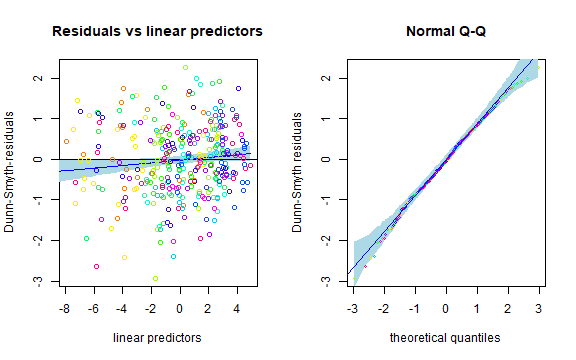
<p class="caption">plot of chunk unnamed-chunk-11</p>
</div>

## Model selection

- Information criteria can be used for model selection.
- For example, compare distributions or choose suitable number of latent variables.


``` r
fitp <- gllvm(y = spider$abund, family = poisson(), num.lv = 2)
fitnb <- gllvm(y = spider$abund, family = "negative.binomial", num.lv = 2)
AIC(fitp)
## [1] 1761.655
AIC(fitnb)
## [1] 1561.361
```


# Exercises

Try to do these exercises for the next 10 minutes, as many as time is enough for.

<span style="color:blue"> E1. Load spider data from **mvabund** package and take a look at the dataset. </span>

``` r
library(gllvm)
data("spider", package = "mvabund")
# more info: 
# ?spider
```

<details><summary><span style="color:red"> Show the answers. </span></summary>

<span style="color:red"> 1. Print the data and covariates and draw a boxplot of the data. </span>

``` r
# response matrix:
spider$abund
##       Alopacce Alopcune Alopfabr Arctlute Arctperi Auloalbi Pardlugu Pardmont
##  [1,]       25       10        0        0        0        4        0       60
##  [2,]        0        2        0        0        0       30        1        1
##  [3,]       15       20        2        2        0        9        1       29
##  [4,]        2        6        0        1        0       24        1        7
##  [5,]        1       20        0        2        0        9        1        2
##  [6,]        0        6        0        6        0        6        0       11
##  [7,]        2        7        0       12        0       16        1       30
##  [8,]        0       11        0        0        0        7       55        2
##  [9,]        1        1        0        0        0        0        0       26
## [10,]        3        0        1        0        0        0        0       22
## [11,]       15        1        2        0        0        1        0       95
## [12,]       16       13        0        0        0        0        0       96
## [13,]        3       43        1        2        0       18        1       24
## [14,]        0        2        0        1        0        4        3       14
## [15,]        0        0        0        0        0        0        6        0
## [16,]        0        3        0        0        0        0        6        0
## [17,]        0        0        0        0        0        0        2        0
## [18,]        0        1        0        0        0        0        5        0
## [19,]        0        1        0        0        0        0       12        0
## [20,]        0        2        0        0        0        0       13        0
## [21,]        0        1        0        0        0        0       16        1
## [22,]        7        0       16        0        4        0        0        2
## [23,]       17        0       15        0        7        0        2        6
## [24,]       11        0       20        0        5        0        0        3
## [25,]        9        1        9        0        0        2        1       11
## [26,]        3        0        6        0       18        0        0        0
## [27,]       29        0       11        0        4        0        0        1
## [28,]       15        0       14        0        1        0        0        6
##       Pardnigr Pardpull Trocterr Zoraspin
##  [1,]       12       45       57        4
##  [2,]       15       37       65        9
##  [3,]       18       45       66        1
##  [4,]       29       94       86       25
##  [5,]      135       76       91       17
##  [6,]       27       24       63       34
##  [7,]       89      105      118       16
##  [8,]        2        1       30        3
##  [9,]        1        1        2        0
## [10,]        0        0        1        0
## [11,]        0        1        4        0
## [12,]        1        8       13        0
## [13,]       53       72       97       22
## [14,]       15       72       94       32
## [15,]        0        0       25        3
## [16,]        2        0       28        4
## [17,]        0        0       23        2
## [18,]        0        0       25        0
## [19,]        1        0       22        3
## [20,]        0        0       22        2
## [21,]        0        1       18        2
## [22,]        0        0        1        0
## [23,]        0        0        1        0
## [24,]        0        0        0        0
## [25,]        6        0       16        6
## [26,]        0        0        1        0
## [27,]        0        0        0        0
## [28,]        0        0        2        0
# Environmental variables
spider$x
##    soil.dry bare.sand fallen.leaves   moss herb.layer reflection
## 1    2.3321    0.0000        0.0000 3.0445     4.4543     3.9120
## 2    3.0493    0.0000        1.7918 1.0986     4.5643     1.6094
## 3    2.5572    0.0000        0.0000 2.3979     4.6052     3.6889
## 4    2.6741    0.0000        0.0000 2.3979     4.6151     2.9957
## 5    3.0155    0.0000        0.0000 0.0000     4.6151     2.3026
## 6    3.3810    2.3979        3.4340 2.3979     3.4340     0.6931
## 7    3.1781    0.0000        0.0000 0.6931     4.6151     2.3026
## 8    2.6247    0.0000        4.2627 1.0986     3.4340     0.6931
## 9    2.4849    0.0000        0.0000 4.3307     3.2581     3.4012
## 10   2.1972    3.9318        0.0000 3.4340     3.0445     3.6889
## 11   2.2192    0.0000        0.0000 4.1109     3.7136     3.6889
## 12   2.2925    0.0000        0.0000 3.8286     4.0254     3.6889
## 13   3.5175    1.7918        1.7918 0.6931     4.5109     3.4012
## 14   3.0865    0.0000        0.0000 1.7918     4.5643     1.0986
## 15   3.2696    0.0000        4.3944 0.6931     3.0445     0.6931
## 16   3.0301    0.0000        4.6052 0.6931     0.6931     0.0000
## 17   3.3322    0.0000        4.4543 0.6931     3.0445     1.0986
## 18   3.1224    0.0000        4.3944 0.0000     3.0445     1.0986
## 19   2.9232    0.0000        4.5109 1.6094     1.6094     0.0000
## 20   3.1091    0.0000        4.5951 0.6931     0.6931     0.0000
## 21   2.9755    0.0000        4.5643 0.6931     1.7918     0.0000
## 22   1.2528    3.2581        0.0000 4.3307     0.6931     3.9120
## 23   1.1939    3.0445        0.0000 4.0254     3.2581     4.0943
## 24   1.6487    3.2581        0.0000 4.0254     3.0445     4.0073
## 25   1.8245    3.5835        0.0000 1.0986     4.1109     2.3026
## 26   0.9933    4.5109        0.0000 1.7918     1.7918     4.3820
## 27   0.9555    2.3979        0.0000 3.8286     3.4340     3.6889
## 28   0.9555    3.4340        0.0000 3.7136     3.4340     3.6889
# Plot data using boxplot:
boxplot(spider$abund)
```

<div class="figure" style="text-align: center">
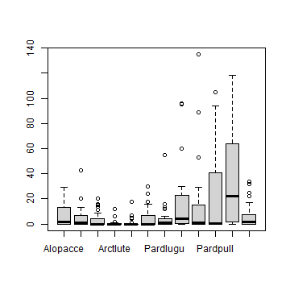
<p class="caption">plot of chunk unnamed-chunk-14</p>
</div>

</details>


<span style="color:blue"> E2. Fit GLLVM to spider data with a suitable distribution. Data consists of counts of spider species.</span>

``` r
# Take a look at the function documentation for help: 
?gllvm
```

<details><summary><span style="color:red"> Show the answers. </span></summary>

<span style="color:red"> 2. Response variables in spider data are counts, so Poisson, negative binomial and zero inflated Poisson are possible. However, ZIP is implemented only with Laplace method, so it need to be noticed, that if models are fitted with different methods they can not be compared with information criteria. Let's try just with a Poisson and NB.</span> 
<span style="color:red"> **NOTE THAT** the results may not be exactly the same as below, as the initial values for each model fit are slightly different, so the results may also differ slightly.</span>

``` r
# Fit a GLLVM to data
fitp <- gllvm(y = spider$abund, family = poisson(), num.lv = 2)
fitp
## Call: 
## gllvm(y = spider$abund, family = poisson(), num.lv = 2)
## family: 
## [1] "poisson"
## method: 
## [1] "VA"
## 
## log-likelihood:  -845.8277 
## Residual degrees of freedom:  301 
## AIC:  1761.655 
## AICc:  1770.055 
## BIC:  1895.254
fitnb <- gllvm(y = spider$abund, family = "negative.binomial", num.lv = 2)
fitnb
## Call: 
## gllvm(y = spider$abund, family = "negative.binomial", num.lv = 2)
## family: 
## [1] "negative.binomial"
## method: 
## [1] "VA"
## 
## log-likelihood:  -733.6806 
## Residual degrees of freedom:  289 
## AIC:  1561.361 
## AICc:  1577.028 
## BIC:  1740.765
```
Based on AIC, NB distribution suits better. How about residual analysis:
<span style="color:red"> **NOTE THAT** The package uses randomized quantile residuals so each time you plot the residuals, they look a little different.</span>

``` r
# Fit a GLLVM to data
plot(fitp)
```

<div class="figure" style="text-align: center">
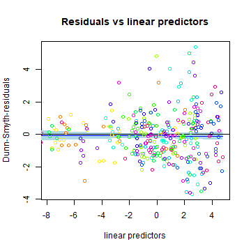
<p class="caption">plot of chunk unnamed-chunk-17</p>
</div><div class="figure" style="text-align: center">
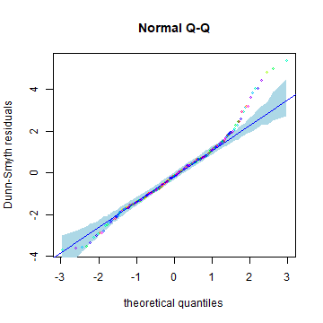
<p class="caption">plot of chunk unnamed-chunk-17</p>
</div><div class="figure" style="text-align: center">
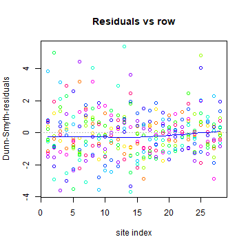
<p class="caption">plot of chunk unnamed-chunk-17</p>
</div><div class="figure" style="text-align: center">
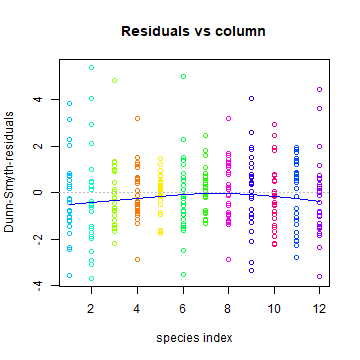
<p class="caption">plot of chunk unnamed-chunk-17</p>
</div><div class="figure" style="text-align: center">
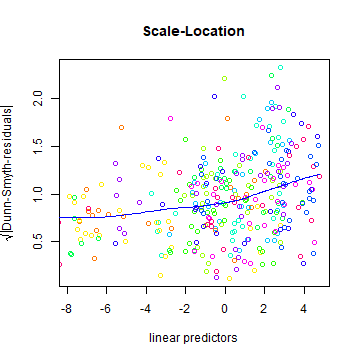
<p class="caption">plot of chunk unnamed-chunk-17</p>
</div>

``` r
plot(fitnb)
```

<div class="figure" style="text-align: center">
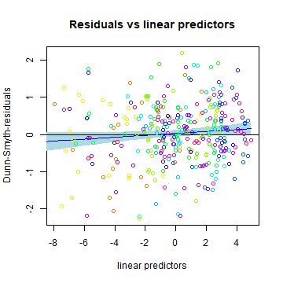
<p class="caption">plot of chunk unnamed-chunk-17</p>
</div><div class="figure" style="text-align: center">
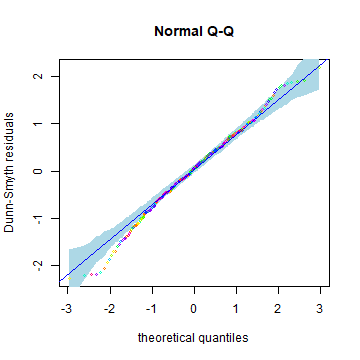
<p class="caption">plot of chunk unnamed-chunk-17</p>
</div><div class="figure" style="text-align: center">
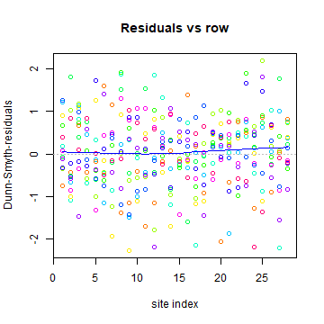
<p class="caption">plot of chunk unnamed-chunk-17</p>
</div><div class="figure" style="text-align: center">
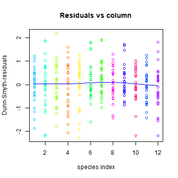
<p class="caption">plot of chunk unnamed-chunk-17</p>
</div><div class="figure" style="text-align: center">
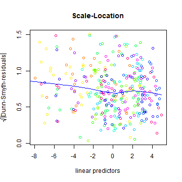
<p class="caption">plot of chunk unnamed-chunk-17</p>
</div>

You could do these comparisons with Laplace method as well, using the code below, and it would give the same conclusion that NB distribution suits best:

``` r
fitLAp <- gllvm(y = spider$abund, family = poisson(), method = "LA", num.lv = 2)
fitLAnb <- gllvm(y = spider$abund, family = "negative.binomial", method = "LA", num.lv = 2)
fitLAzip <- gllvm(y = spider$abund, family = "ZIP", method = "LA", num.lv = 2)
AIC(fitLAp)
AIC(fitLAnb)
AIC(fitLAzip)
```


</details>


<span style="color:blue"> E3. Explore the fitted model. Where are the estimates for parameters? What about predicted latent variables? Standard errors?</span>

<details><summary><span style="color:red"> Show the answers. </span></summary>

<span style="color:red"> 3. Lets explore the fitted model: </span>

``` r
# Parameters:
coef(fitnb)
## $Species.scores
##                 LV1         LV2
## Alopacce  1.0000000  0.00000000
## Alopcune -0.2631385  1.00000000
## Alopfabr  0.9015674 -0.48406396
## Arctlute -0.7036463  2.03039378
## Arctperi  0.5939420 -1.58944155
## Auloalbi -0.6526981  1.53312812
## Pardlugu -0.8886075 -0.02803983
## Pardmont  0.7498075  0.58844212
## Pardnigr -0.5748692  1.78026159
## Pardpull -0.4146908  1.94809473
## Trocterr -0.4694548  0.78799563
## Zoraspin -0.6964199  1.15697849
## 
## $sigma.lv
##      LV1      LV2 
## 1.803188 1.829258 
## 
## $Intercept
##   Alopacce   Alopcune   Alopfabr   Arctlute   Arctperi   Auloalbi   Pardlugu 
##  0.7740401  0.5514600 -0.1420799 -3.5928704 -3.3659483 -0.7312122  0.3187389 
##   Pardmont   Pardnigr   Pardpull   Trocterr   Zoraspin 
##  1.6247625 -0.2756369 -0.1351566  2.6556641  0.2458849 
## 
## $inv.phi
##   Alopacce   Alopcune   Alopfabr   Arctlute   Arctperi   Auloalbi   Pardlugu 
##  1.3062086  1.4686581  0.7051261  0.8975738  2.3318712  1.5391668  1.1528603 
##   Pardmont   Pardnigr   Pardpull   Trocterr   Zoraspin 
##  1.6178848  2.5410766  2.1962049 12.9777881  2.5728412 
## 
## $phi
##   Alopacce   Alopcune   Alopfabr   Arctlute   Arctperi   Auloalbi   Pardlugu 
## 0.76557448 0.68089367 1.41818609 1.11411446 0.42884015 0.64970214 0.86740778 
##   Pardmont   Pardnigr   Pardpull   Trocterr   Zoraspin 
## 0.61809097 0.39353399 0.45533091 0.07705473 0.38867537
# Where are the predicted latent variable values? just fitp$lvs or
getLV(fitnb)
##               LV1          LV2
## Row1   0.92852665  1.270526811
## Row2  -0.68268574  0.793817393
## Row3   0.67619469  1.274454709
## Row4  -0.24715832  1.149862877
## Row5  -0.36105292  1.217245046
## Row6  -0.35230795  1.008709368
## Row7   0.02923147  1.426067893
## Row8  -1.52132930 -0.070695384
## Row9   0.91073156  0.001254016
## Row10  1.03735150 -0.493609735
## Row11  1.48871623  0.303019366
## Row12  1.32413534  0.807379914
## Row13  0.11539177  1.356639384
## Row14 -0.43681536  1.014602323
## Row15 -1.31926230 -0.544659047
## Row16 -1.17467121 -0.242675413
## Row17 -1.11256043 -0.512786158
## Row18 -1.15894853 -0.542936116
## Row19 -1.34068171 -0.502763573
## Row20 -1.36735439 -0.592066571
## Row21 -1.13970149 -0.475608835
## Row22  0.76440045 -1.345942893
## Row23  0.92080212 -1.380612030
## Row24  0.97904941 -1.395231847
## Row25  0.63126094  0.576848284
## Row26  0.27407588 -1.964091600
## Row27  1.11555883 -1.309364313
## Row28  1.01881765 -0.825791430
# Standard errors for parameters:
fitnb$sd
## $theta
##                LV1       LV2
## Alopacce 0.0000000 0.0000000
## Alopcune 0.2736267 0.0000000
## Alopfabr 0.3301676 0.2043818
## Arctlute 0.6749336 0.7849229
## Arctperi 0.4757302 0.5592186
## Auloalbi 0.4407894 0.3892606
## Pardlugu 0.2275813 0.2005396
## Pardmont 0.2196724 0.1816365
## Pardnigr 0.4734843 0.3799181
## Pardpull 0.4966160 0.4106412
## Trocterr 0.2098678 0.1568704
## Zoraspin 0.3480339 0.2796563
## 
## $sigma.lv
##       LV1       LV2 
## 0.4163279 0.4257672 
## 
## $beta0
##  Alopacce  Alopcune  Alopfabr  Arctlute  Arctperi  Auloalbi  Pardlugu  Pardmont 
## 0.4518433 0.4630233 0.5478106 1.7105332 1.4645696 0.7893144 0.4391408 0.3996833 
##  Pardnigr  Pardpull  Trocterr  Zoraspin 
## 0.7870468 0.8340664 0.3339029 0.5831002 
## 
## $inv.phi
##  Alopacce  Alopcune  Alopfabr  Arctlute  Arctperi  Auloalbi  Pardlugu  Pardmont 
## 0.6025142 0.6026050 0.3957366 0.5786972 1.8042524 0.8383692 0.5810474 0.7756785 
##  Pardnigr  Pardpull  Trocterr  Zoraspin 
## 1.3150258 1.2472328 6.8923154 1.2850999 
## 
## $phi
##   Alopacce   Alopcune   Alopfabr   Arctlute   Arctperi   Auloalbi   Pardlugu 
## 0.35313613 0.27937743 0.79592589 0.71830852 0.33180901 0.35388642 0.43717786 
##   Pardmont   Pardnigr   Pardpull   Trocterr   Zoraspin 
## 0.29633745 0.20365673 0.25858408 0.04092265 0.19413817
```

</details>


<span style="color:blue"> E4. Fit model with different numbers of latent variables.</span>

<details><summary><span style="color:red"> Show the answers. </span></summary>

<span style="color:red"> 4. Default number of latent variables is 2. Let's try 1 and 3 latent variables as well: </span>

``` r
# In exercise 2, we fitted GLLVM with two latent variables 
fitnb
## Call: 
## gllvm(y = spider$abund, family = "negative.binomial", num.lv = 2)
## family: 
## [1] "negative.binomial"
## method: 
## [1] "VA"
## 
## log-likelihood:  -733.6806 
## Residual degrees of freedom:  289 
## AIC:  1561.361 
## AICc:  1577.028 
## BIC:  1740.765
# How about 1 or 3 LVs
fitnb1 <- gllvm(y = spider$abund, family = "negative.binomial", num.lv = 1)
fitnb1
## Call: 
## gllvm(y = spider$abund, family = "negative.binomial", num.lv = 1)
## family: 
## [1] "negative.binomial"
## method: 
## [1] "VA"
## 
## log-likelihood:  -759.4012 
## Residual degrees of freedom:  300 
## AIC:  1590.802 
## AICc:  1599.712 
## BIC:  1728.218
getLV(fitnb1)
##               LV1
## Row1  -0.81680073
## Row2  -0.94960122
## Row3  -0.91686912
## Row4  -1.10568858
## Row5  -1.22147801
## Row6  -1.03402030
## Row7  -1.26770149
## Row8  -0.53474156
## Row9   0.36606728
## Row10  1.00893946
## Row11  0.31291924
## Row12 -0.31670240
## Row13 -1.17620958
## Row14 -1.03498387
## Row15 -0.09008979
## Row16 -0.27457777
## Row17 -0.02446327
## Row18 -0.02079539
## Row19 -0.12968783
## Row20 -0.06888265
## Row21 -0.04322837
## Row22  1.54084953
## Row23  1.65026910
## Row24  1.68381578
## Row25 -0.28901266
## Row26  1.92919639
## Row27  1.62341240
## Row28  1.20021507
fitnb3 <- gllvm(y = spider$abund, family = "negative.binomial", num.lv = 3)
fitnb3
## Call: 
## gllvm(y = spider$abund, family = "negative.binomial", num.lv = 3)
## family: 
## [1] "negative.binomial"
## method: 
## [1] "VA"
## 
## log-likelihood:  -733.6806 
## Residual degrees of freedom:  279 
## AIC:  1581.361 
## AICc:  1605.145 
## BIC:  1798.937
getLV(fitnb3)
##               LV1          LV2           LV3
## Row1   0.92852193  1.270517554  1.570906e-06
## Row2  -0.68267997  0.793808485 -5.923863e-07
## Row3   0.67620859  1.274452800  2.206767e-06
## Row4  -0.24715258  1.149856940 -5.511246e-07
## Row5  -0.36105638  1.217234013  1.494794e-07
## Row6  -0.35231637  1.008694594 -1.961469e-06
## Row7   0.02921728  1.426053605  5.229652e-07
## Row8  -1.52134410 -0.070713396 -4.646292e-07
## Row9   0.91075038  0.001244108 -1.834690e-06
## Row10  1.03735796 -0.493599590 -1.511016e-06
## Row11  1.48870575  0.303009356 -1.281949e-06
## Row12  1.32414236  0.807374236 -1.051523e-06
## Row13  0.11539876  1.356634037  6.418344e-07
## Row14 -0.43681431  1.014593060 -8.041465e-07
## Row15 -1.31925066 -0.544663401  6.586915e-07
## Row16 -1.17467022 -0.242686442  3.194167e-07
## Row17 -1.11253581 -0.512786958  7.808483e-07
## Row18 -1.15894230 -0.542945344  1.466848e-06
## Row19 -1.34067920 -0.502774734  2.397866e-07
## Row20 -1.36735809 -0.592080722  5.034523e-07
## Row21 -1.13969651 -0.475617105 -1.994209e-07
## Row22  0.76440714 -1.345944619  1.583108e-07
## Row23  0.92079227 -1.380624212  6.407873e-07
## Row24  0.97905177 -1.395237221 -3.414712e-07
## Row25  0.63127724  0.576845950  9.534752e-07
## Row26  0.27408817 -1.964101966  4.310826e-07
## Row27  1.11556287 -1.309370886 -3.437038e-07
## Row28  1.01881057 -0.825794528  1.553483e-07
```

</details>


<span style="color:blue"> E5. Include environmental variables to the GLLVM and explore the model fit. </span>

<details><summary><span style="color:red"> Show the answers. </span></summary>

<span style="color:red"> 5. Environmental variables can be included with an argument `X`: </span>

``` r
fitnbx <- gllvm(y = spider$abund, X = spider$x, family = "negative.binomial", seed = 123, num.lv = 2)
fitnbx
## Call: 
## gllvm(y = spider$abund, X = spider$x, family = "negative.binomial", 
##     num.lv = 2, seed = 123)
## family: 
## [1] "negative.binomial"
## method: 
## [1] "VA"
## 
## log-likelihood:  -593.6748 
## Residual degrees of freedom:  217 
## AIC:  1425.35 
## AICc:  1557.572 
## BIC:  1879.586
coef(fitnbx)
## $Species.scores
##                  LV1          LV2
## Alopacce  1.00000000 0.000000e+00
## Alopcune -0.47999235 1.000000e+00
## Alopfabr -1.42214187 5.841183e-01
## Arctlute -1.84252688 1.151829e+00
## Arctperi -0.05345499 1.728959e-09
## Auloalbi -1.28921930 6.094543e-01
## Pardlugu -0.92483074 1.960846e-01
## Pardmont  1.27268753 3.640863e-01
## Pardnigr -0.84274239 1.070871e+00
## Pardpull  0.92011795 7.282328e-01
## Trocterr  0.77970731 4.991102e-01
## Zoraspin  0.64950115 7.372555e-01
## 
## $sigma.lv
##          LV1          LV2 
## 1.498262e-08 9.497929e-01 
## 
## $Intercept
##    Alopacce    Alopcune    Alopfabr    Arctlute    Arctperi    Auloalbi 
##  -1.8104719  -4.4231761  -1.6440728 -14.6907091 -14.9068218 -15.7120672 
##    Pardlugu    Pardmont    Pardnigr    Pardpull    Trocterr    Zoraspin 
##   7.9328780  -6.3805017  -5.1536211 -13.0274478  -0.2005081  -3.8446745 
## 
## $Xcoef
##            soil.dry   bare.sand fallen.leaves        moss  herb.layer
## Alopacce -0.9582289 -0.09058744   -0.32436172  0.10121585  0.73702467
## Alopcune  1.3489939 -0.45006153    0.01728544 -0.19941571  0.41950435
## Alopfabr -0.8697885  0.69558765   -0.40323099  0.54009582  0.30197069
## Arctlute  5.8729230  0.16612309   -1.67199770  0.34347434 -0.12385222
## Arctperi -1.7801398  0.23852941   -2.81599502  0.49572539  0.02124531
## Auloalbi  0.2248121 -0.04630290    0.62845467  0.06253851  4.05078681
## Pardlugu -2.5236568 -0.71545007    0.36220153 -0.37423992  0.58639054
## Pardmont  1.5851881  0.13323268   -0.51424778  0.88735774  0.73423915
## Pardnigr  2.5563804 -0.02661043   -0.84827668 -0.45634965  0.72878359
## Pardpull  3.0006705 -0.35244270   -0.47038895  0.36473478  1.95132820
## Trocterr  1.2400198 -0.23012823   -0.22748129 -0.20324268  0.44584372
## Zoraspin  2.0998897  0.11998154   -0.57210596 -0.08996063  0.62001603
##           reflection
## Alopacce  0.86919489
## Alopcune  0.42096994
## Alopfabr  0.06162081
## Arctlute -0.64317129
## Arctperi  4.00607608
## Auloalbi -0.54353432
## Pardlugu -1.16975989
## Pardmont  0.07820717
## Pardnigr -0.53379045
## Pardpull -0.36809860
## Trocterr -0.29459392
## Zoraspin -0.93160670
## 
## $inv.phi
##     Alopacce     Alopcune     Alopfabr     Arctlute     Arctperi     Auloalbi 
## 9.153165e+00 2.937725e+00 7.756438e+00 2.022804e+00 1.155663e+09 1.022799e+01 
##     Pardlugu     Pardmont     Pardnigr     Pardpull     Trocterr     Zoraspin 
## 2.772496e+01 1.990656e+00 7.671870e+00 1.667539e+01 2.643148e+01 6.321736e+00 
## 
## $phi
##     Alopacce     Alopcune     Alopfabr     Arctlute     Arctperi     Auloalbi 
## 1.092518e-01 3.403995e-01 1.289252e-01 4.943633e-01 8.653039e-10 9.777095e-02 
##     Pardlugu     Pardmont     Pardnigr     Pardpull     Trocterr     Zoraspin 
## 3.606858e-02 5.023470e-01 1.303463e-01 5.996860e-02 3.783367e-02 1.581844e-01
# confidence intervals for parameters:
confint(fitnbx)
##                                      2.5 %        97.5 %
## sigma.lv.LV1                 -7.808747e-06  7.838712e-06
## sigma.lv.LV2                  4.336848e-01  1.465901e+00
## theta.LV1.1                   1.000000e+00  1.000000e+00
## theta.LV1.2                  -3.515095e+08  3.515095e+08
## theta.LV1.3                  -2.066984e+08  2.066984e+08
## theta.LV1.4                  -4.066872e+08  4.066872e+08
## theta.LV1.5                  -7.551866e+02  7.550797e+02
## theta.LV1.6                  -2.155730e+08  2.155730e+08
## theta.LV1.7                  -6.941846e+07  6.941846e+07
## theta.LV1.8                  -1.278590e+08  1.278590e+08
## theta.LV1.9                  -3.789195e+08  3.789195e+08
## theta.LV1.10                 -2.580354e+08  2.580354e+08
## theta.LV1.11                 -1.772700e+08  1.772700e+08
## theta.LV1.12                 -2.626032e+08  2.626032e+08
## theta.LV2.1                   0.000000e+00  0.000000e+00
## theta.LV2.2                   1.000000e+00  1.000000e+00
## theta.LV2.3                  -5.150052e-02  1.219737e+00
## theta.LV2.4                  -1.944715e-01  2.498129e+00
## theta.LV2.5                  -7.101356e-05  7.101701e-05
## theta.LV2.6                   5.415648e-02  1.164752e+00
## theta.LV2.7                  -1.286063e-01  5.207755e-01
## theta.LV2.8                  -1.511637e-01  8.793364e-01
## theta.LV2.9                   4.318042e-01  1.709939e+00
## theta.LV2.10                  2.701489e-01  1.186317e+00
## theta.LV2.11                  2.336340e-01  7.645864e-01
## theta.LV2.12                  2.325228e-01  1.241988e+00
## Intercept.Alopacce           -5.313745e+00  1.692801e+00
## Intercept.Alopcune           -9.576493e+00  7.301409e-01
## Intercept.Alopfabr           -7.969464e+00  4.681318e+00
## Intercept.Arctlute           -3.133815e+01  1.956729e+00
## Intercept.Arctperi           -2.629942e+01 -3.514222e+00
## Intercept.Auloalbi           -2.247099e+01 -8.953142e+00
## Intercept.Pardlugu            3.194875e+00  1.267088e+01
## Intercept.Pardmont           -1.043166e+01 -2.329339e+00
## Intercept.Pardnigr           -1.019976e+01 -1.074854e-01
## Intercept.Pardpull           -1.860700e+01 -7.447891e+00
## Intercept.Trocterr           -2.429816e+00  2.028800e+00
## Intercept.Zoraspin           -7.700062e+00  1.071278e-02
## Xcoef.soil.dry:Alopacce      -1.627866e+00 -2.885922e-01
## Xcoef.soil.dry:Alopcune      -1.660549e-01  2.864043e+00
## Xcoef.soil.dry:Alopfabr      -1.961736e+00  2.221592e-01
## Xcoef.soil.dry:Arctlute       4.237221e-01  1.132212e+01
## Xcoef.soil.dry:Arctperi      -3.435259e+00 -1.250206e-01
## Xcoef.soil.dry:Auloalbi      -9.612443e-01  1.410869e+00
## Xcoef.soil.dry:Pardlugu      -3.776393e+00 -1.270921e+00
## Xcoef.soil.dry:Pardmont       6.323259e-01  2.538050e+00
## Xcoef.soil.dry:Pardnigr       1.053218e+00  4.059543e+00
## Xcoef.soil.dry:Pardpull       1.556298e+00  4.445043e+00
## Xcoef.soil.dry:Trocterr       5.869441e-01  1.893095e+00
## Xcoef.soil.dry:Zoraspin       9.198910e-01  3.279888e+00
## Xcoef.bare.sand:Alopacce     -3.852463e-01  2.040714e-01
## Xcoef.bare.sand:Alopcune     -9.738169e-01  7.369379e-02
## Xcoef.bare.sand:Alopfabr      1.976007e-01  1.193575e+00
## Xcoef.bare.sand:Arctlute     -1.530029e+00  1.862275e+00
## Xcoef.bare.sand:Arctperi     -6.815162e-01  1.158575e+00
## Xcoef.bare.sand:Auloalbi     -4.621839e-01  3.695782e-01
## Xcoef.bare.sand:Pardlugu     -1.248294e+00 -1.826060e-01
## Xcoef.bare.sand:Pardmont     -1.852340e-01  4.516993e-01
## Xcoef.bare.sand:Pardnigr     -5.133013e-01  4.600804e-01
## Xcoef.bare.sand:Pardpull     -8.536577e-01  1.487723e-01
## Xcoef.bare.sand:Trocterr     -4.442669e-01 -1.598951e-02
## Xcoef.bare.sand:Zoraspin     -2.625482e-01  5.025113e-01
## Xcoef.fallen.leaves:Alopacce -9.897257e-01  3.410022e-01
## Xcoef.fallen.leaves:Alopcune -5.797587e-01  6.143296e-01
## Xcoef.fallen.leaves:Alopfabr -1.537066e+00  7.306040e-01
## Xcoef.fallen.leaves:Arctlute -3.797375e+00  4.533797e-01
## Xcoef.fallen.leaves:Arctperi -3.865577e+02  3.809257e+02
## Xcoef.fallen.leaves:Auloalbi  1.123402e-01  1.144569e+00
## Xcoef.fallen.leaves:Pardlugu  3.926230e-02  6.851408e-01
## Xcoef.fallen.leaves:Pardmont -1.026755e+00 -1.740831e-03
## Xcoef.fallen.leaves:Pardnigr -1.464641e+00 -2.319127e-01
## Xcoef.fallen.leaves:Pardpull -9.510105e-01  1.023260e-02
## Xcoef.fallen.leaves:Trocterr -4.819572e-01  2.699459e-02
## Xcoef.fallen.leaves:Zoraspin -1.030257e+00 -1.139550e-01
## Xcoef.moss:Alopacce          -2.225859e-01  4.250176e-01
## Xcoef.moss:Alopcune          -7.950549e-01  3.962235e-01
## Xcoef.moss:Alopfabr           1.279464e-02  1.067397e+00
## Xcoef.moss:Arctlute          -9.123152e-01  1.599264e+00
## Xcoef.moss:Arctperi          -1.222201e-01  1.113671e+00
## Xcoef.moss:Auloalbi          -4.180093e-01  5.430863e-01
## Xcoef.moss:Pardlugu          -8.454754e-01  9.699552e-02
## Xcoef.moss:Pardmont           4.273696e-01  1.347346e+00
## Xcoef.moss:Pardnigr          -1.039298e+00  1.265987e-01
## Xcoef.moss:Pardpull          -8.543248e-02  8.149020e-01
## Xcoef.moss:Trocterr          -4.719699e-01  6.548454e-02
## Xcoef.moss:Zoraspin          -5.684694e-01  3.885482e-01
## Xcoef.herb.layer:Alopacce     3.371290e-01  1.136920e+00
## Xcoef.herb.layer:Alopcune    -3.379510e-01  1.176960e+00
## Xcoef.herb.layer:Alopfabr    -2.708238e-01  8.747652e-01
## Xcoef.herb.layer:Arctlute    -3.060431e+00  2.812727e+00
## Xcoef.herb.layer:Arctperi    -4.106483e-01  4.531389e-01
## Xcoef.herb.layer:Auloalbi     2.456661e+00  5.644912e+00
## Xcoef.herb.layer:Pardlugu     2.740864e-01  8.986947e-01
## Xcoef.herb.layer:Pardmont     4.665241e-02  1.421826e+00
## Xcoef.herb.layer:Pardnigr    -1.335758e-01  1.591143e+00
## Xcoef.herb.layer:Pardpull     9.273144e-01  2.975342e+00
## Xcoef.herb.layer:Trocterr     1.165970e-01  7.750905e-01
## Xcoef.herb.layer:Zoraspin    -1.607867e-02  1.256111e+00
## Xcoef.reflection:Alopacce     3.389648e-01  1.399425e+00
## Xcoef.reflection:Alopcune    -3.763269e-01  1.218267e+00
## Xcoef.reflection:Alopfabr    -9.860900e-01  1.109332e+00
## Xcoef.reflection:Arctlute    -1.929951e+00  6.436085e-01
## Xcoef.reflection:Arctperi     1.460167e+00  6.551985e+00
## Xcoef.reflection:Auloalbi    -1.141657e+00  5.458823e-02
## Xcoef.reflection:Pardlugu    -1.807533e+00 -5.319870e-01
## Xcoef.reflection:Pardmont    -5.106920e-01  6.671063e-01
## Xcoef.reflection:Pardnigr    -1.302882e+00  2.353011e-01
## Xcoef.reflection:Pardpull    -8.995571e-01  1.633599e-01
## Xcoef.reflection:Trocterr    -6.349114e-01  4.572360e-02
## Xcoef.reflection:Zoraspin    -1.527920e+00 -3.352931e-01
## phi.Alopacce                 -1.058596e+01  2.889229e+01
## phi.Alopcune                 -7.209241e-02  5.947542e+00
## phi.Alopfabr                 -8.210019e+00  2.372289e+01
## phi.Arctlute                 -1.057750e+00  5.103358e+00
## phi.Arctperi                 -4.273697e+12  4.276008e+12
## phi.Auloalbi                 -3.754770e+00  2.421074e+01
## phi.Pardlugu                 -4.821338e+01  1.036633e+02
## phi.Pardmont                  5.019674e-01  3.479344e+00
## phi.Pardnigr                 -1.345705e+00  1.668944e+01
## phi.Pardpull                 -4.388604e+00  3.773939e+01
## phi.Trocterr                 -3.376383e+00  5.623935e+01
## phi.Zoraspin                 -1.191290e+00  1.383476e+01
```

</details>

<details><summary><span style="color:red"> Problems? See hints:</span></summary>

<span style="color:red"> I have problems in model fitting. My model converges to infinity or local maxima: </span> 
GLLVMs are complex models where starting values have a big role. Choosing a different starting value method (see argument `starting.val`) or use multiple runs and pick up the one giving highest log-likelihood value using argument `n.init`. More variation to the starting points can be added with `jitter.var`.

<span style="color:red"> My results does not look the same as in answers:</span> 
The results may not be exactly the same as in the answers, as the initial values for each model fit are slightly different, so the results may also differ slightly.

</details>

# Ordination

## GLLVM as a model based ordination method

-  GLLVMs can be used as a model-based approach to unconstrained ordination by including two latent variables in the model: $g(E(y_{ij})) = \beta_{0j} + \boldsymbol{u}_i'\boldsymbol{\theta}_j$

- The latent variable term try to capture the underlying factors driving species abundances at sites.

- Predictions for the two latent variables, $\boldsymbol{\hat u}_i=(\hat u_{i1}, \hat u_{i2})$, then provide coordinates for sites in the ordination plot and then provides a graphical representation of which sites are similar in terms of their species composition.


## Ordination plot

- `ordiplot()` produces ordination plots based on fitted GLLVMs.
- Uncertainty of the ordination points in model based ordination can be assessed with prediction regions based on the prediction errors of latent variables.
- Prediction regions may also help interpreting which differences between ordination points are really a sign of the difference between species composition at those sites.

<div class="figure" style="text-align: center">
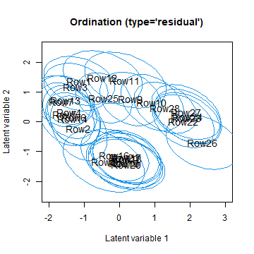
<p class="caption">plot of chunk unnamed-chunk-22</p>
</div>

## Biplot

- Between species correlations can be visualized with biplot^[Gabriel, K. R. (1971). The biplot graphic display of matrices with application to principal component analysis. Biometrika, 58, 453-467] by adding latent variable loadings $\boldsymbol{\theta}_j$ to the ordination of sites, by producing a biplot, (argument `biplot = TRUE` in `ordiplot()`).
- In a biplot latent variables and their loadings are rotated so that the LV loadings of the species are in the same direction with the sites where they are most abundant.
- Biplot can be used for finding groups of correlated species or finding indicator species common at specific sites.
- For example, species named Pardlugu is common in the group of sites located on the bottom (eg sites 8, 19, 20 and 21). 
- x and y axes may help the interpretation.


``` r
ordiplot(fitnb, biplot = TRUE)
abline(h = 0, v = 0, lty=2)
```

<div class="figure" style="text-align: center">
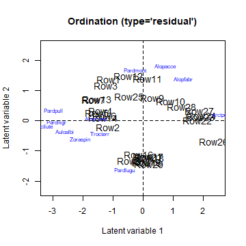
<p class="caption">plot of chunk unnamed-chunk-23</p>
</div>


## Environmental gradients

- The potential impact of environmental variables on species communities can be viewed by coloring ordination points according to the variables.
- For example, species named Pardlugu seems to prefer sites with lot of dry soil mass and low reflection of the soil surface with a cloudless sky.

``` r
# Arbitrary color palette, a vector length of 20. Can use, for example, colorRampPalette from package grDevices
rbPal <- c("#00FA9A", "#00EC9F", "#00DFA4", "#00D2A9", "#00C5AF", "#00B8B4", "#00ABB9", "#009DBF", "#0090C4", "#0083C9", "#0076CF", "#0069D4", "#005CD9", "#004EDF", "#0041E4", "#0034E9", "#0027EF", "#001AF4", "#000DF9", "#0000FF")
X <- spider$x
par(mfrow = c(3,2), mar=c(4,4,2,2))
for(i in 1:ncol(X)){
Col <- rbPal[as.numeric(cut(X[,i], breaks = 20))]
ordiplot(fitnb, symbols = T, s.colors = Col, main = colnames(X)[i], 
         biplot = TRUE)
}
```

<div class="figure" style="text-align: center">
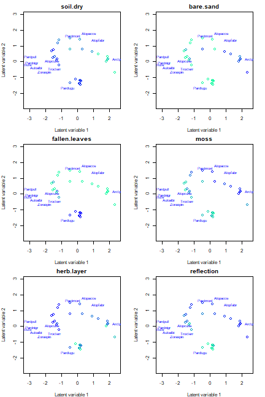
<p class="caption">plot of chunk unnamed-chunk-24</p>
</div>

- Here environmental gradients stand out quite clearly, indicating that, at least, some of the differences in species compositions at sites can be explained by the differences in environmental conditions.

- The next step would be to include covariates to the model to study more precisely the effects of environmental variables:
$g(E(y_{ij})) = \beta_{0j} + \boldsymbol{x}_i'\boldsymbol{\beta}_{j} + \boldsymbol{u}_i'\boldsymbol{\theta}_j$

