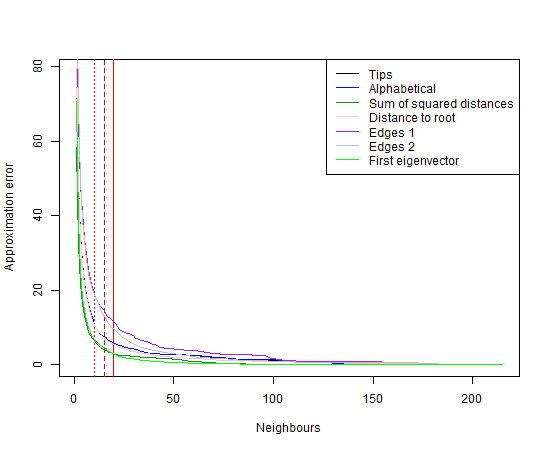
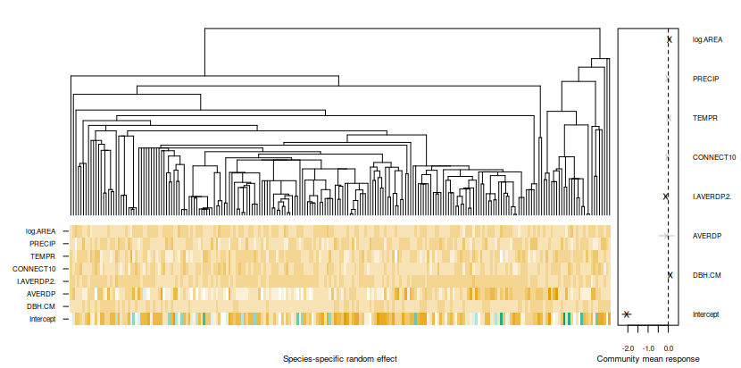
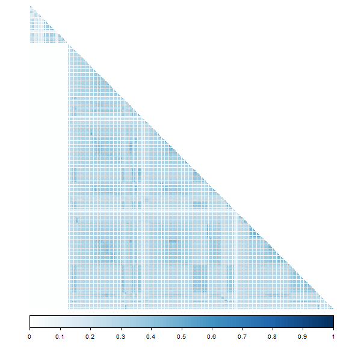

This vignette is divided into two parts, the first part related to models with environment covariates only, and the second part for models that additionally incorporate trait covariates, so called "fourth corner" models. This is for convenience, as the interface for fitting fourth corner models slightly differs from the models without traits. Both models are detailed in @vanderVeen2024, and the fourth corner model in more detail in @Niku2021.

__For more information about fitting trait models with random effects, see also vignette 1.__

# Phylogenetically structured environmental responses

In this vignette we demonstrate how to fit models that incorporate phylogenetic information into the random effects. For this, we make use of an adjusted version of the familiar lme4-formula interface [@lme4, @lme4_software].

Here, we will use the data by @Abrego2022a. It includes information of 215 fungal species at 1666 *European beech* logs, and was analyzed by the original authors using a similar model. We start by loading the data:


``` r
library(gllvm)

data(fungi)
Y <- fungi$Y
X <- fungi$X
tree <- fungi$tree # the tree
colMat <- fungi$C # e.g., from ape::vcv(tree)
dist <- fungi$dist # e.g., from ape::cophenetic.phylo(tree)

# Scale the predictors
covs <- c("DBH.CM","AVERDP","CONNECT10","TEMPR","PRECIP","log.AREA")
X[,covs] <- scale(X[, covs])
```

The included version of the package does not contain all available environmental covariates, only those used in the original analysis. This includes diameter at breast height (DBH.CM), decay stage (AVERDP), connectivity of the surrounding forest (CONNECT10), annual temperature range, annual precipitation, and the logarithm of the reserve's area.

We can think of the model as having two covariance matrices: one with correlation between covariate effects, and another that incorporates the correlation between species due to the phylogeny. The former is specified via the formula interface, the form of the latter is (more or less) fixed at present.

## Species ordering

It is important to note that the error of the NNGP approximation that is used for fitting the models depends somewhat on the order of the species in the data [@Guinness2018]. The software can minimize the number of VA parameters necessary by utilizing block structure in the phylogeny (i.e., full independence due to top splits), so the ideal ordering is often that provided by the tip labels in the phylogeny (__so make sure not to arbitrarily order the response data__). The VA method in the gllvm package retains block structure of the phylogenetic covariance matrix. This is not necessarily optimal in terms of approximation error of the NNGP.

A less than ideal ordering requires a larger number of nearest neighbours for an accurate approximation. For cases when the ordering in from the phylogenetic tree seems to function poorly, we provide a function (note, not exported) in the package to help evaluate the error due to a certain species ordering `findOrder()`. This calculates the Frobenius norm of the product of the sparse approximation to the inverse of the phylogenetic covariance matrix and the phylogenetic covariance matrix, minus the identity matrix, given a species order and number of nearest neighbours. It returns the error, the approximation, and the ordering (which retains the block structure if `withinBlock = TRUE`, the default). In short: a lower error means a better approximation (but note the trade-off). Here is some code to demonstrate this:


``` r
# order of species in phylogeny tips
# with a plot of error vs. nearest neighbours
err1 <- NULL
for(i in 1:215){
approx1 <- gllvm:::findOrder(covMat = colMat, distMat = dist, nn = i)
err1 <- c(err1, approx1$err)
}
plot(y=err1,x=1:215,type="l", xlab = "Neighbours", ylab = "Approximation error")
abline(v = 10, col = "red", lty = "dotted")
abline(v = 15, col = "red", lty = "dashed")
abline(v = 20, col = "red")

# order species alphabetically
err2 <- NULL
for(i in 1:215){
approx2 <- gllvm:::findOrder(covMat = colMat, distMat = dist, nn = i, order = order(tree$tip.label))
err2 <- c(err2, approx2$err)
}
lines(y=err2,x=1:215,col="blue")

# order species by sum of distances
order = order(colSums(dist),decreasing=TRUE)
err3 <- NULL
for(i in 1:215){
approx3 <- gllvm:::findOrder(covMat = colMat, distMat = dist, nn = i, order = order)
err3 <- c(err3, approx3$err)
}
lines(y=err3,x=1:215,col="forestgreen")

# order species by distance to the root
allDists <- ape::dist.nodes(tree)
err4 <- NULL
for(i in 1:215){
approx4 <- gllvm:::findOrder(covMat = colMat, distMat = dist, nn = i, order = as.integer(names(sort(allDists[1:length(tree$tip.label), nrow(allDists)],decreasing = TRUE))))
err4 <- c(err4, approx4$err)
}
lines(y=err4,x=1:215,col="pink")

# order by internal order of edges
# order <- ape::reorder.phylo(tree, order = "postorder", index.only=TRUE)
# err5 <- NULL
# for(i in 1:215){
# approx5 <- gllvm:::findOrder(covMat = colMat, distMat = dist, nn = i, order = order[order<=length(tree$tip.label)])
# err5 <- c(err5, approx5$err)
# }
# lines(y=err5,x=1:215,col="purple")
#
# order <- ape::reorder.phylo(tree, order = "pruningwise", index.only=TRUE)
# err6 <- NULL
# for(i in 1:215){
# approx6 <- gllvm:::findOrder(covMat = colMat, distMat = dist, nn = i, order = order[order<=length(tree$tip.label)])
# err6 <- c(err6, approx6$err)
# }
# lines(y=err6,x=1:215,col="grey")

# by first eigenvector
err7 <- NULL
order=order(eigen(colMat)$vec[,1],decreasing=TRUE)
for(i in 1:215){
approx7 <- gllvm:::findOrder(covMat = colMat, distMat = dist, nn = i, order = order)
err7 <- c(err7, approx7$err)
}
lines(y=err7,x=1:215,col="green")

# squared covariances
order = order(sapply(1:215,function(i, colMat)sum(colMat[i,][-1]^2), colMat = colMat),decreasing=FALSE)
err8 <- NULL
for(i in 1:215){
    approx8 <- gllvm:::findOrder(covMat = colMat, distMat = dist, nn = i, order = order)
    err8 <- c(err8, approx8$err)
}
lines(y=err8,x=1:215,col="brown")

# order by the distance of the n nearest neighbours
err9 <- NULL
for(i in 1:215){
    order = order(sapply(1:215,function(j,dist,nn)sum(dist[j,-j][order(dist[j,-j],decreasing=FALSE)[1:nn]]),nn=i,dist=dist),decreasing=TRUE)
    approx9 <- gllvm:::findOrder(covMat = colMat, distMat = dist, nn = i, order = order)
    err9 <- c(err9, approx9$err)
}
lines(y=err9,x=1:215,col="orange")

# minium sum to preceding species
#get colMat blocks first
p=215
blocks = list()
  B = 1
  E = B
  while(B<=p){
    while(E<p && (any(colMat[(E+1):p,B:E]!=0)|any(colMat[B:E,(E+1):p]!=0))){
      # expand block
      E = E+1;
    }
    # save block
    blocks[[length(blocks)+1]] = colMat[B:E,B:E,drop=FALSE]
    E = E+1;
    B = E;
  }
  err10 <- NULL
for(i in 1:215){
  ord <- NULL
  blocksp <- 0
  for(k in 1:length(blocks)){
    idx <- 1:nrow(blocks[[k]])
    ordnew <- which.max(apply(blocks[[k]],2,max))
    idx <- idx[idx!=ordnew]
for(l in 2:nrow(blocks[[k]])){
  #add entry of next species with min(i,nn) largest neighbour entries
  spec <- idx[which.min(sapply(idx,function(j,nn){
    x <- sum(blocks[[k]][ordnew,j])
    # x <- x[x!=0]
    # sum(x[order(x,decreasing=TRUE)[1:min(i,nn)]])
  }, nn = i))]
  ordnew <- c(ordnew,spec)
  idx <- idx[idx!=spec]
}
    ord <- c(ord, ordnew+blocksp)
    blocksp <- blocksp + nrow(blocks[[k]])
  }

approx10 <- gllvm:::findOrder(covMat = colMat, distMat = dist, nn = i, order = ord)
err10 <- c(err10, approx10$err)
}
lines(1:215,err10, col="purple")

# species with minimum of maximum distance to preceding species
# similar to algorithm maxmin from guiness2018?
p=215
blocks = list()
  B = 1
  E = B
  while(B<=p){
    while(E<p && (any(colMat[(E+1):p,B:E]!=0)|any(colMat[B:E,(E+1):p]!=0))){
      # expand block
      E = E+1;
    }
    # save block
    blocks[[length(blocks)+1]] = colMat[B:E,B:E,drop=FALSE]
    E = E+1;
    B = E;
  }
  err11 <- NULL
for(i in 1:215){
  ord <- NULL
  blocksp <- 0
  for(k in 1:length(blocks)){
    idx <- 1:nrow(blocks[[k]])
    ordnew <- which.max(apply(blocks[[k]],2,max))
    idx <- idx[idx!=ordnew]
for(l in 2:nrow(blocks[[k]])){
  #add entry of next species with min(i,nn) largest neighbour entries
  spec <- idx[which.min(sapply(idx,function(j,nn){
    x <- max(blocks[[k]][ordnew,j])
    # x <- x[x!=0]
    # sum(x[order(x,decreasing=TRUE)[1:min(i,nn)]])
  }, nn = i))]
  ordnew <- c(ordnew,spec)
  idx <- idx[idx!=spec]
}
    ord <- c(ord, ordnew+blocksp)
    blocksp <- blocksp + nrow(blocks[[k]])
  }

approx11 <- gllvm:::findOrder(covMat = colMat, distMat = dist, nn = i, order = ord)
err11 <- c(err11, approx11$err)
}
lines(1:215,err11, col="grey")


legend("topright", legend=c("Tips","Alphabetical", "Total distance", "Distance to root", "First eigenvector","Sum of squared covariances","Total distance (nn)", "minsum", "maxmin"), col=c("black","blue", "forestgreen","pink", "green", "brown","orange","purple","grey"),lty = rep("solid",9))
```

<div class="figure" style="text-align: center">

<p class="caption">plot of chunk specord</p>
</div>

``` r
#low number of neighbours: 3 is best.
#plot(y=apply(cbind(err1,err2,err3,err4,err7,err8,err9,err10,err11),1,which.min),x=1:215)
```

The red lines indicate 10, 15, and 20 neighbours. Clearly, ordering the species by the sum of distances, sum of squared covariances, or by the first eigenvector of the phylogenetic covariance matrix, give good approximations (i.e., most accurate with least neighbours) for this dataset.

<!-- # The function has a "withinBlock" argument -->
<!-- # to find if we can find a better ordering while retaining the block diagonal structure -->
<!-- # try some random permutations within block -->
<!-- errold <- Inf -->
<!-- order1 <- NULL -->
<!-- for(i in 1:10){ -->
<!-- order <- sample(size=215, x=1:215) -->
<!-- approx<-findOrder(covMat = colMat, distMat = dist, -->
<!--           order = order, withinBlock = TRUE) -->
<!-- errnew<-approx$err -->
<!-- if(is.null(order1)|errnew<err){ -->
<!--   order1<-order -->
<!--   err <- errnew -->
<!-- } -->
<!-- } -->
<!-- err -->

This serves to demonstrate that the species order does matter to the approximation, and a better order may be available. In the plot we can see that the error reduces quickly towards 10-15 neighbours, and levels out after about 50 neighbours. If we plotted the same curve wit the computation time, it would probably exhibit the opposite of the displayed pattern.

## Fit the model


``` r
TMB::openmp(parallel::detectCores()-1, autopar = TRUE) # set parallel computation
order <- gllvm:::findOrder(covMat = colMat, distMat = dist, nn = 15,
          order = as.integer(names(sort(allDists[1:length(tree$tip.label), nrow(allDists)],decreasing = TRUE))))$order
order <- tree$tip.label[order]
model1 <- gllvm(y = Y[,order], X = X,
        formula = ~(DBH.CM + AVERDP + I(AVERDP^2) + CONNECT10 + TEMPR + PRECIP + log.AREA|1), beta0com = TRUE,
                     family = "binomial", num.lv = 0, sd.errors = FALSE,
                     studyDesign = X[,c("REGION", "RESERVE")], row.eff = ~(1 | REGION/RESERVE),
                     colMat = list(colMat[order,order], dist = dist[order,order]), colMat.rho.struct = "term", nn.colMat = 15,
        optim.method = "L-BFGS-B")
```

Let's walk through some of the specified arguments.

The first line enables parallel computation, to speed up model fitting.

  Note that an intercept term is included in the random effects, which can be excluded by incorporating a zero in the formula term. Correlations are included between covariates inside the brackets, so we could have uncorrelated effects by including them all in separately bracketed terms. We specify `num.lv = 0` for now, although we could just as well include latent variables (e.g., we could fit a model with phylogenetically structured random intercepts and a (un)constrained ordination), and `beta0comm` to have a single (fixed) intercept for the whole community (species-specific intercepts enter via the random effects). `sd.errors` is here for convenience set to false, as it can take a (much) longer time to calculate standard errors than to fit the model, and we should really only calculate the standard errors when we need them (e.g., for visualization). The `gllvm::se.gllvm` function can post-hoc calculate the standard errors, so that we do not need to refit the model.

  The `studyDesign` matrix is specified to additionally incorporated random intercepts for the nested study design. and a formula `row.eff` to specify the random intercept structure.
  The `colMat` term is how we pass the phylogenetic information to the model, which is usually a list of length two, where one argument is called `dist` and the other is the covariance matrix from the tree. Note that these two matrices need to have the same column names as `Y`. `nn.colMat` is the number of nearest neighbours to consider for each species on the tree, which is fixed to 10 by default. Smaller numbers usually result in a faster fitting model, but one that is potentially less accurate. @vanderVeen2024 showed that 10-15 neighbours is usually a good choice, although fewer/more also still lead to accurate estimates for the phylogenetic signal, but this can be quite problem dependent. `colMat.rho.struct` has two options, `single` fitting a model with the same phylogenetic signal parameter for all covariates (default) and `term` fitting a model with a phylogenetic signal parameter per covariate.
  Finally, the last line changes the optimisation method to one that seems to usually do well with this model type, and changes the starting values of the random effect (which was needed to fit this model succesfully).

After model fitting, the random effect estimates can be found in `model1$params$Br`, and prediction errors can be extracted with `gllvm::getPredictErr`. This requires the standard errors, so let's calculate thosefirst:


``` r
# calculate standard errors
ses <- se.gllvm(model1) # this can take a few minutes
model1$sd <- ses$sd
model1$Hess <- ses$Hess
```

Here is some code to visualize the model results (from @vanderVeen2024):


``` r
row.names(model1$params$Br) <- c("Intercept", "Deadwood size", "Decay stage", "Decay stage²", "Connectivity", "Temperature range", "Precipitation","ln(Reserve area)")

# strike REs that are not significant
PEs <- gllvm::getPredictErr(model1)
PIs <- data.frame(cbind(LI = c(model1$params$Br)-c(PEs$Br*1.96), UI = c(model1$params$Br)+c(PEs$Br*1.96)))
model1$params$Br[-which((PIs$LI>0 & PIs$UI>0) | (PIs$LI<0 & PIs$UI<0))]<-NA

layout(cbind(rbind(2,1),c(3,3)), respect = TRUE, heights = c(1.25,1), widths=c(2,0.5))
par(mar=c(5,5,0,0))
image(1L:ncol(model1$y), 1:ncol(model1$col.eff$spdr), t(model1$params$Br[,tree$tip.label]), col = colorRampPalette(c("#E69F00","white","#009E73"))(28), axes=FALSE, ylim = 0.5+c(0,ncol(model1$col.eff$spdr)),xlim=0.5+c(0,ncol(model1$y)),xlab=NA, breaks = seq(-3.5,3.5,by=.25), ylab=NA)
mtext(side=1, text="Species-specific random effect",padj=4, cex = 0.6)
axis(2, at= 1:ncol(model1$col.eff$spdr), labels=colnames(t(model1$params$Br)),las=1, cex.axis = 0.6, lwd=0)
par(xpd=TRUE)
for(i in 1:ncol(model1$col.eff$spdr)){
  lines(x=c(-2,0),y=c(i,i))
}

par(mar=c(0,1,2,0))
library(ape)
plot(tree, show.tip.label = FALSE, direction = "downwards",xaxs="i")
# caterpillar
coefs <- c(model1$params$beta0[1],model1$params$B[1:(ncol(model1$col.eff$spdr)-1)])
sds <- c(model1$sd$beta0[1],model1$sd$B[2:(ncol(model1$col.eff$spdr))])
CIs <- data.frame(cbind(LI=coefs+sds*qnorm(1-0.95), UI=coefs+sds*qnorm(0.95)))
names(coefs) <- c("Intercept", "Deadwood size", "Decay stage", "Decay stage²", "Connectivity", "Temperature range", "Precipitation", "ln(Reserve area)")
cols <- rep("black", 8)
cols[-which((CIs$LI>0 & CIs$UI>0) | (CIs$LI<0 & CIs$UI<0))] <- "grey"

par(mar=c(5,0.5,2,5), xpd=FALSE)

plot(coefs, y = 1:length(coefs), yaxt="n",ylab="", pch="x", col = cols, xlab = NA, cex.axis = 0.6, xlim = c(-max(abs(coefs)),max(abs(coefs))))
mtext(side = 1, text = "Community mean response", padj = 4, cex = 0.6)
segments(x0 = CIs$LI, y0 = 1:length(coefs), x1 = CIs$UI, y1 = 1:length(coefs), col = cols)
abline(v = 0, lty="dashed")
axis(4, at = 1:length(coefs), labels = names(coefs), las = 1, cex.axis = 0.6,lwd=0)
```

<div class="figure" style="text-align: center">

<p class="caption">plot of chunk bigplot</p>
</div>

The random effects with a prediction interval including zero are crossed out in the plot. The `getResidualCov` and `getResidualCor` functions extract the residual covariance and correlation matrix, respectively, for visualizing species associations.


``` r
corrplot::corrplot(getEnvironCor(model1),
                   type = "lower", diag = FALSE, order = "AOE",
                   tl.pos = "n", addgrid.col=NA, col.lim=c(0,1))
```

<div class="figure" style="text-align: center">

<p class="caption">plot of chunk corrplot</p>
</div>

The `randomCoefPlot` function constructs caterpillar plots of species deviations from the community mean responses, which can be extracted via the summary method, or found via `coef` and in `model1$params$B`.

Arguments to control the VA approximation are `Ab.struct` and `Ab.struct.rank`, for details see @vanderVeen2024. NOTE: Use `Ab.struct = "CL1"` or `Ab.struct="CL2"` only in parallel when using `TMB::openmp(.., autopar=TRUE)`. Without TMB's "automatic" parallelization feature, memory use is excessively and your computer will probably run out of memory (for a moderately large number of sites and species) so that your R session will crash.

<!--(but, note that changing both of these options will likely cause a significant increase in memory use when combined with parallel computation).-->

Finally, we can look at the summary information of the model:


``` r
summary(model1)
```

```
##
## Call:
## gllvm(y = Y[, order], X = X, formula = ~(DBH.CM + AVERDP + I(AVERDP^2) +
##     CONNECT10 + TEMPR + PRECIP + log.AREA | 1), family = "binomial",
##     num.lv = 0, studyDesign = X[, c("REGION", "RESERVE")], colMat = list(colMat[order,
##         order], dist = dist[order, order]), colMat.rho.struct = "term",
##     row.eff = ~(1 | REGION/RESERVE), sd.errors = FALSE, beta0com = TRUE,
##     nn.colMat = 15, optim.method = "L-BFGS-B")
##
## Family:  binomial
##
## AIC:  103080 AICc:  103080 BIC:  103662.6 LL:  -51486 df:  54
##
## Informed LVs:  0
## Constrained LVs:  0
## Unconstrained LVs:  0
##
## Formula:  ~(DBH.CM + AVERDP + I(AVERDP^2) + CONNECT10 + TEMPR + PRECIP + log.AREA | 1)
## LV formula:  ~ 0
##
## Random effects:
##  Name        Signal Variance Std.Dev Corr
##  Intercept   0.2106 0.5218   0.7224
##  DBH.CM      0.5031 0.0052   0.0722   0.7524
##  AVERDP      0.9711 0.3825   0.6185   0.1015 -0.0181
##  I.AVERDP.2. 0.8007 0.0122   0.1105  -0.4874 -0.4696 -0.4871
##  CONNECT10   0.0613 0.0270   0.1642  -0.1800 -0.1082  0.1563 -0.1128
##  TEMPR       0.0499 0.0436   0.2087  -0.1579 -0.2858 -0.0683  0.7212  0.3666
##  PRECIP      0.0000 0.0324   0.1799   0.2290  0.6520 -0.3145  0.0977 -0.5629
##  log.AREA    0.0310 0.0158   0.1258  -0.1418 -0.1302  0.0928 -0.6283  0.4803
##
##
##
##
##
##
##
##  -0.2123
##  -0.5604 -0.5228
##
## Coefficients predictors:
##             Estimate Std. Error z value Pr(>|z|)
## Intercept   -2.05756    0.13590 -15.140  < 2e-16 ***
## DBH.CM       0.10583    0.01936   5.465 4.62e-08 ***
## AVERDP      -0.08548    0.22763  -0.376 0.707278
## I.AVERDP.2. -0.12467    0.03344  -3.728 0.000193 ***
## CONNECT10   -0.03260    0.04141  -0.787 0.431209
## TEMPR        0.03646    0.04454   0.818 0.413120
## PRECIP      -0.02091    0.03726  -0.561 0.574756
## log.AREA     0.05643    0.02976   1.896 0.057952 .
## ---
## Signif. codes:  0 '***' 0.001 '**' 0.01 '*' 0.05 '.' 0.1 ' ' 1
```

which gives us an overview of the community mean responses, as well as the variance and correlation of random effects, and the phylogenetic signal parameter in the column `signal`. This parameter ranges between zero and one, at zero the species responses are not phylogenetically structured, and at one they are fully phylogenetically structured.

<!-- The `confint` function returns (approximate asysmptotic) confidence intervals for all parameters, including the phylogenetic signal. We might instead want to use TMB's functionality for calculating a profile confidence interval instead (since it will be more accurate and appropriate, though it tends to take quite a lot of time) for the phylogenetic signal parameters: -->

<!-- ```{r, cache = TRUE, message=FALSE, warning=FALSE, echo = -6, eval = FALSE} -->
<!-- profs <- list() -->
<!-- # This may take a few minutes -->
<!-- for(i in 1:ncol(model1$col.eff$spdr)){ -->
<!--   profs[[i]] <- TMB::tmbprofile(model1$TMBfn, name = tail(which(names(model1$TMBfn$par)=="sigmaB"), ncol(model1$col.eff$spdr))[i], h = 1, parm.range = c(-12,3.5)) -->
<!-- } -->
<!-- ``` -->

<!-- ```{r, echo = FALSE} -->
<!-- load("model1profs.RData") -->
<!-- library(TMB) -->
<!-- ``` -->

<!-- ```{r, warning=FALSE, error=FALSE} -->
<!-- for(i in 1:length(profs)){ -->
<!--   profs[[i]][,1] <- exp(-exp(profs[[i]][,1])) -->
<!--   plot(profs[[i]][!apply(profs[[i]],1,anyNA),]) -->
<!-- } -->
<!-- ``` -->

# Phylogenetic fourth corner model

The fourth corner model extends the previous model with functional traits. The interface is still a little difference, so that correlation between random effects are always included. Otherwise the tools are similar, so we just present some example code here for fitting such a model, but do not discuss it further (see other vignettes in the gllvm R-package for discussion of the fourth corner model).


``` r
TR <- fungi$TR # the functional traits

model2 <- gllvm(y = Y, X = cbind(int = 1, X), TR = TR,
                     formula = ~DBH.CM + AVERDP + I(AVERDP^2) + CONNECT10 +
  TEMPR + PRECIP + log.AREA + (DBH.CM + AVERDP + I(AVERDP^2) + CONNECT10 + TEMPR + PRECIP + log.AREA):(PC1.1 + PC1.2 + PC1.3),
                      family = "binomial", num.lv = 0, studyDesign = X[, c("REGION", "RESERVE")],
                      colMat = list(C, dist = dist),
                      colMat.rho.struct = "term", row.eff = ~(1 | REGION/RESERVE), sd.errors = FALSE,
                      randomX = ~int + DBH.CM + AVERDP + I(AVERDP^2) + CONNECT10 + TEMPR + PRECIP + log.AREA,
                      beta0com = TRUE, Ab.struct = "MNunstructured", nn.colMat = 10, max.iter = 20000, maxit = 20000, optim.method = "L-BFGS-B",
randomX.start = "res")
```

# References

---
references:
- id: vanderVeen2024
  title: Fast fitting of phylogenetic mixed effects models
  author:
  - family: van der Veen
    given: B.
  - family: O'Hara
    given: R.B.
  publisher:
  volume:
  page:
  type: article-journal
  issued:
    year: 2024
  doi: https://www.arxiv.org/abs/2408.05333

- id: lme4_software
  title: "Lme4: Linear Mixed-Effects Models Using 'Eigen' and S4"
  author:
    - family: Bates
      given: Douglas
    - family: Maechler
      given: Martin
    - family: Bolker
      given: Ben
    - family: Walker
      given: Steven
    - family: Christensen
      given: Rune Haubo Bojesen
    - family: Singmann
      given: Henrik
    - family: Dai
      given: Bin
    - family: Scheipl
      given: Fabian
    - family: Grothendieck
      given: Gabor
    - family: Green
      given: Peter
    - family: Fox
      given: John
    - family: Bauer
      given: Alexander
    - family: Krivitsky
      given: Pavel N.
    - family: Tanaka
      given: Emi
    - family: Jagan
      given: Mikael
  publisher: CRAN
  URL: https://cran.r-project.org/web/packages/lme4/index.html
  type: software
  issued:
    year: 2024
    month: 07
    day: 03
  version: 1.1-35.5


- id: lme4
  title: Fitting Linear Mixed-effects Models using lme4
  author:
  - family: Bates
    given: D.
  - family: Mächler
    given: M.
  - family: Bolker
    given: B.
  - family: Walker
    given: S.
  publisher: Journal of Statistical Software
  volume: 67
  page: 1--48
  type: article-journal
  issued:
    year: 2015

- id: Abrego2022a
  title: "Data and code from: Traits and phylogenies module the environmental responses of wood-inhabiting fungal communities across spatial scales"
  author:
  - family: Abrego
    given: N.
  - family: Bässler
    given: C.
  - family: Christensen
    given: M.
  - family: Heilmann-Clausen
    given: J.
  type: dataset
  issued:
    year: 2015
  publisher: Dryad
  doi: https://doi.org/10.5061/dryad.t76hdr82r

- id: Abrego2022b
  title: Traits and phylogenies module the environmental responses of wood-inhabiting fungal communities across spatial scales
  author:
  - family: Abrego
    given: N.
  - family: Bässler
    given: C.
  - family: Christensen
    given: M.
  - family: Heilmann-Clausen
    given: J.
  publisher: Journal of Ecology
  volume: 110
  page: 784-798
  type: article-journal
  issued:
    year: 2022

- id: Niku2021
  title: Analyzing environmental-trait interactions in ecological communities with fourth-corner latent variable models
  author:
  - family: Niku
    given: J.
  - family: Hui
    given: F.K.C.
  - family: Taskinen
    given: S.
  - family: Warton
    given: D.I.
  publisher: Environmetrics
  volume: 32.6
  page: e2683
  type: article-journal
  issued:
    year: 2021

- id: Guinness2018
  title: Permutation and Grouping Methods for Sharpening Gaussian Process Approximations
  author:
  - family: Guinness
    given: J.
  publisher: Technometrics
  volume: 60
  page: 415-429
  type: article-journal
  issued:
    year: 2018

---

