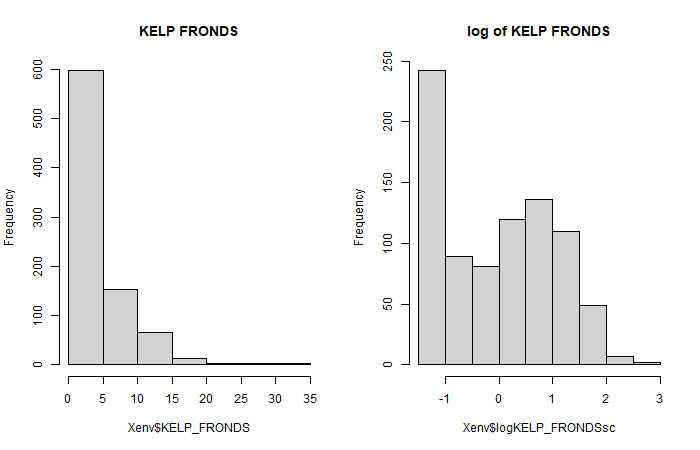
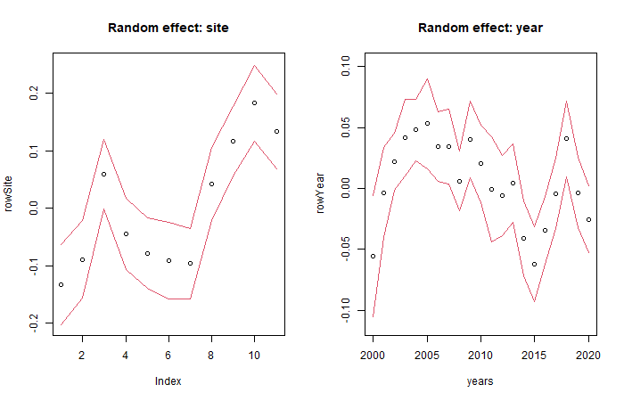
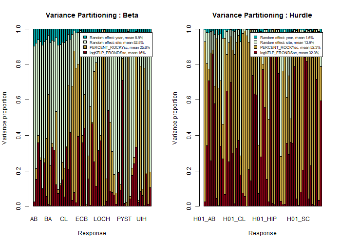
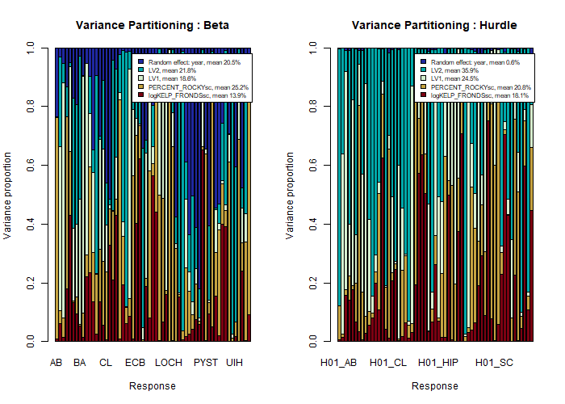
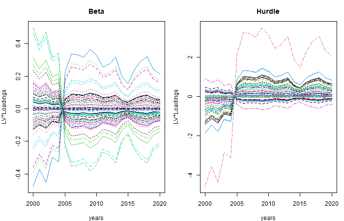

<!-- This is pre-computed vignette -->

In this example we demonstrate how to set correlation structures for latent variables and random effects in **gllvm**. The species abundances are often correlated in time or spatially in community ecology. In **gllvm**, such correlation structures can now be set either for latent variables or comunity level random row effects. 

Denote the abundance of the $j$th species ($j\in \{1,\dots, p\}$) at the $i$th site ($i\in \{1,\dots, n\}$) as $y_{ij}$. A set of k environmental variables, or experimental treatments, may also be recorded at each site and stored in the vector $\boldsymbol{x}_i = (x_{i1}, ..., x_{ik})$. A common form for the GLLVM is then defined for the mean abundance $\mu_{ij}$:

$$g(\mu_{ij}) = \eta_{ij} = r_{s_a(i)} + \beta_{0j} + \boldsymbol{x}_i'\boldsymbol{\beta}_j + \boldsymbol{u}_{s_u(i)}'\boldsymbol{\theta}_j,$$

Now we can specify a correlation structure for latent variables $\boldsymbol{u}_{s_u(i)} = ({u}_{1,s_u(i)}, \dots, {u}_{d,s_u(i)})'$ ($d=$ number of latent variables, defined by `num.lv` in **gllvm**) and/or community level row effects $r_{s_r(i)}$. The subscripts $s_u(i)$ defines the structure of the latent variables. For instance, assume that we have a hierarchical sampling design with $n_s<n$ sites and sites are sampled $n_t$ times in consecutive years. Thus we could want to include a site level latent variables such that $s_u(i) = k$ if sampling unit $i$ is from site $k$ ($k\in \{1,\dots, n_s\}$). Similarly, we can set a structure for the row effects defining subscript $s_r(i)$, eg. for time $s_r(i) = t$ if sampling unit $i$ is from sampling year $t$ ($t\in \{1,\dots, n_t\}$). Then we can define the correlation structures for latent variables and/or row effects: denote $\boldsymbol{u}_{q.} = (u_{q1}, ..., u_{qn_s})$
$$
{u}_{q.} \sim N(\boldsymbol{0}, \Sigma_q), \,  q=1,\dots, d.
$$
The covariance matrix $\Sigma_q$ defines the correlation structure and has unit variances on diagonal. The options are identity (independent), AR(1) correlation, exponentially decaying correlation structure and Matern correlation. Currently we can only use the same structure for all latent variables $q=1,\dots,d$, but the parameters defining the strength of the correlation is estimated uniquely for each latent variable.

Similarly, we can define the correlation structure for random row effect, denote $\boldsymbol{r} = (r_{1}, ..., r_{n_t})$, and set
$$
{r} \sim N(\boldsymbol{0}, \Sigma_r),
$$
where the covariance matrix $\Sigma_r$ is a $n_t \times n_t$ matrix and defines the correlation structure for random row effect. For row effects we have the same options as we have for latent variables. The structure for the row effects can be different from the structure of the latent variables and this is illustrated in the case study below.

As an example, we use time series of sessile algal and invertebrate species from permanent transects  (Arkema et al. 2009, @SBCLTER2023). Data consists of percent cover of 132 species from 11 sites which each have 2-8 transects, yearly recorded from 2000 to 2021. It also includes measurements of the environment; the number of stripes of giant kelp and percent rock. In total, data has 836 sampling units.


``` r
library(gllvm)
```


``` r
data("kelpforest")
Yabund <- kelpforest$Y
Xenv <- kelpforest$X
SPinfo <- kelpforest$SPinfo
```

Species percent cover matrix is in `Yabund`, for the analyses we consider only sessile invertebrates and include species observed at least 10 times. The rarest species are modeled as a sum.


``` r
Yabund[1:10,1:20]
```

```
##    AB AL AMZO   ANSP AR ARUD     AS ATM     AU     BA BAEL BCAL     BF BLD     BN
## 1   0  0    0 0.0125  0    0 0.1125   0 0.0125 0.0000    0    0 0.0000   0 0.0125
## 2   0  0    0 0.0000  0    0 0.0000   0 0.0000 0.0000    0    0 0.0125   0 0.0000
## 3   0  0    0 0.0000  0    0 0.0750   0 0.0000 0.0000    0    0 0.0000   0 0.0000
## 4   0  0    0 0.0000  0    0 0.0125   0 0.0000 0.0000    0    0 0.0125   0 0.0000
## 5   0  0    0 0.0000  0    0 0.0000   0 0.0000 0.0000    0    0 0.0000   0 0.0000
## 6   0  0    0 0.0000  0    0 0.0000   0 0.0000 0.0000    0    0 0.0000   0 0.0000
## 7   0  0    0 0.0000  0    0 0.0000   0 0.0000 0.0000    0    0 0.0000   0 0.0000
## 8   0  0    0 0.0000  0    0 0.0000   0 0.0000 0.0000    0    0 0.0000   0 0.0000
## 9   0  0    0 0.0000  0    0 0.0500   0 0.0000 0.0125    0    0 0.0000   0 0.0000
## 10  0  0    0 0.0000  0    0 0.0250   0 0.0000 0.0000    0    0 0.0125   0 0.0000
##    BO BOW BPSE     BR    BRA
## 1   0   0    0 0.0250 0.0375
## 2   0   0    0 0.0250 0.0125
## 3   0   0    0 0.0375 0.0000
## 4   0   0    0 0.0000 0.0000
## 5   0   0    0 0.0125 0.0000
## 6   0   0    0 0.0000 0.0125
## 7   0   0    0 0.0000 0.0000
## 8   0   0    0 0.0000 0.0000
## 9   0   0    0 0.1000 0.0000
## 10  0   0    0 0.1000 0.0875
```

``` r
Yinvert <- Yabund[SPinfo$GROUP == "INVERT"]
Yinvert10 = Yinvert[,colSums(Yinvert>0, na.rm = TRUE)>9]
# Sum species that were observed less than 9 times, 
Yinvert10$Sum_inv = rowSums(Yinvert[,(colSums(Yinvert>0, na.rm = TRUE)<=9)], na.rm = TRUE)
```
There is information about the species:


``` r
head(SPinfo)
```

```
##   SP_CODE  GROUP            COMMON_NAME     SCIENTIFIC_NAME TAXON_KINGDOM
## 1      AB INVERT Coarse Sea Fir Hydroid    Abietinaria spp.      Animalia
## 2      AL INVERT  Aggregating cup Coral    Astrangia haimei      Animalia
## 3    AMZO  ALGAE                   <NA> Amphiroa beauvoisii       Plantae
## 4    ANSP INVERT    Aggregating anemone    Anthopleura spp.      Animalia
## 5      AR INVERT          Sand Tunicate  Eudistoma psammion      Animalia
## 6    ARUD INVERT              Octocoral   Discophyton rudyi      Animalia
##   TAXON_PHYLUM     TAXON_CLASS     TAXON_ORDER    TAXON_FAMILY TAXON_GENUS
## 1     Cnidaria        Hydrozoa    Leptothecata   Sertulariidae Abietinaria
## 2     Cnidaria        Anthozoa    Scleractinia    Rhizangiidae   Astrangia
## 3   Rhodophyta Florideophyceae    Corallinales Lithophyllaceae    Amphiroa
## 4     Cnidaria        Anthozoa      Actiniaria      Actiniidae Anthopleura
## 5     Chordata      Ascidiacea Aplousobranchia   Polycitoridae   Eudistoma
## 6     Cnidaria        Anthozoa      Alcyonacea     Alcyoniidae Discophyton
```

``` r
SPinfo10 = SPinfo[SPinfo$SP_CODE %in% colnames(Yinvert10),]
SPinfo10 = rbind(SPinfo10,c("Sum_inv","INVERT", rep(NA, ncol(SPinfo10)-2)))
```

And finally, information about the study design (site name, year, transect index) and environmental coefficients (average number of kelp fronds, percent rock). The distribution of kelp fronds is very skewed to the right so a log of the number of kelp fronds is used as a covariate instead. In addition, covariates are scaled.


``` r
head(Xenv)
```

```
##   SITE YEAR TRANSECT KELP_FRONDS PERCENT_ROCKY
## 1 ABUR 2001        1     13.8750          35.0
## 2 ABUR 2001        2      0.0000          37.5
## 3 ABUR 2002        1      8.5125          10.0
## 4 ABUR 2002        2      0.3875           2.5
## 5 ABUR 2003        1      0.6000           0.0
## 6 ABUR 2003        2      0.0000           0.0
```

``` r
par(mfrow=c(1,2))
hist(Xenv$KELP_FRONDS, main = "KELP FRONDS")
Xenv$logKELP_FRONDS = log(Xenv$KELP_FRONDS+1)
Xenv$logKELP_FRONDSsc = scale(Xenv$logKELP_FRONDS)
Xenv$PERCENT_ROCKYsc = scale(Xenv$PERCENT_ROCKY)
hist(Xenv$logKELP_FRONDSsc, main = "log of KELP FRONDS")
```

<div class="figure" style="text-align: center">

<p class="caption">plot of chunk Xcovar</p>
</div>

For modeling percent cover data, \texttt{gllvm} has three options, beta for values (0,1), ordered beta for [0,1] and beta hurdle model for [0,1). Here we use beta-hurdle response model.

## Structured and correlated community level random row effects

The structure for community level row effects can be defined using argument `row.eff` and defining the study design using argument `studyDesign`. The structure is defined by common formula interface; eg. `row.eff = ~(1|site)` and `site` factor in a `data.frame` given in argument `studyDesign` defines site level random effects. There are four correlation structures available in \texttt{gllvm}, AR(1) `corAR1`, compound symmetry `corCS`, exponentially decaying `corExp` and Matern correlation `corMatern`. If one would like to set eg. spatial correlation structure for the site level random effects, it could be defined for instance by `row.eff = ~corExp(1|site)` and spatial coordinates given to `dist` as a matrix. Multiple row effect structures are allowed.

In the next example, we attempt to model species abundances correlation in time using AR(1) correlated community level random effect for sampling year as well as site level row effects. Latent variables are left out from this model for now.


``` r
# Define the study design, now we need year and site
studyDesign = data.frame(year = factor(Xenv$YEAR), site = factor(Xenv$SITE))
# Set common shape parameter of beta distribution for different species (optional)
shapeForm = rep(1, ncol(Yinvert10))
```


``` r
# Fit model with AR(1) correlated random effect for sampling year
ftRowAR <- gllvm(Yinvert10, Xenv, family = "betaH", 
                 formula = ~ logKELP_FRONDSsc + PERCENT_ROCKYsc, 
                 studyDesign = studyDesign, 
                 row.eff = ~ (1|site) + corAR1(1|year),  
                 num.lv = 0, disp.formula = shapeForm)
```


``` r
ftRowAR
```

```
## Call: 
## gllvm(y = Yinvert10, X = Xenv, formula = ~logKELP_FRONDSsc + 
##     PERCENT_ROCKYsc, family = "betaH", num.lv = 0, studyDesign = studyDesign, 
##     row.eff = ~(1 | site) + corAR1(1 | year), disp.formula = shapeForm)
## family: 
## [1] "betaH"
## method: 
## [1] "VA"
## 
## log-likelihood:  -1448.781 
## Residual degrees of freedom:  48907 
## AIC:  3731.561 
## AICc:  3738.689 
## BIC:  7403.732
```

If we look at the estimates, sd of the random effect for site is 0.106 and for year is 0.037 and AR(1) correlation between two consecutive years is 0.57. See below the parameter values and the row effects for years


``` r
# sds for random row effects and Correlation for consecutive years
ftRowAR$params$sigma
```

```
##       site       year    yearrho 
## 0.10601458 0.03676497 0.57861515
```

``` r
# Plot random effects and 95% predicted envelope
rowSite = ftRowAR$params$row.params[1:ftRowAR$grps.row["site"]]
years = matrix(as.numeric(levels(studyDesign$year)))
rowYear = ftRowAR$params$row.params[-(1:ftRowAR$grps.row["site"])]
# Calculate prediction errors for row effects:
predLVR = getPredictErr(ftRowAR)
# prediction errors for site effects
seSite = predLVR$row.effects[[1]]
# prediction errors for year effects
seYear = predLVR$row.effects[[2]]
# Plot:
par(mfrow=c(1,2))
plot(rowSite, ylim = range(rowSite) + c(-1.96,1.96)*max(abs(seSite)), main = "Random effect: site")
lines(rowSite - 1.96*seSite, col=2)
lines(rowSite + 1.96*seSite, col=2)
plot(years, rowYear, ylim = range(rowYear) + c(-1.96,1.96)*max(abs(seYear)), main = "Random effect: year")
lines(years, rowYear - 1.96*seYear, col=2)
lines(years, rowYear + 1.96*seYear, col=2)
```

<div class="figure" style="text-align: center">

<p class="caption">plot of chunk plotrow</p>
</div>

The random effect for year represents the average trend of the all species abundances over the years which is not explained by the covariates.

To evaluate how much of the variation random effects and covariates are able to explain, calculate variance partitioning for the model. The random effect for year explains on average only 1.6% and the random effect for site 13.9% of the variation when modeling the probability of the presence, while conditional on the presence of the species, random year explains on average 5.9% and random site 52.5% of the variation of the coverage.


``` r
VP1 <- varPartitioning(ftRowAR)
plotVP(VP1, args.legend = list(cex=0.7), col=hcl.colors(5, "Roma"))
```

<div class="figure" style="text-align: center">

<p class="caption">plot of chunk VP1</p>
</div>


## Structured and correlated latent variables

### Structured latent variables

In the previous example, we did not include latent variables in the model, but let's focus on them now. Similarly to community level row effects we can now set a structure for the latent variables as well using argument `lvCor`. For instance, we could like to account the variation in transects and sites and possible missing environmental covariates that affect the species abundances. So let's include in the model also transect level latent variables, leave random effect for site out:


``` r
# Define the study design, now we need year and site x transect
Xenv$STRANSECT =  factor(paste(Xenv$SITE,Xenv$TRANSECT, sep = ""))
studyDesign = data.frame(year = factor(Xenv$YEAR), stransect = factor(Xenv$STRANSECT))
# Fit model with AR(1) correlated random effect for sampling year
# and two transect level latent variable (two LVs model was better than 1 LV)
# Different starting values can be tested but zero starting values worked best in this case:
# (This can take a few minutes ~2-5)
```


``` r
ftRowAR_lv2 <- gllvm(Yinvert10, Xenv, family = "betaH",
                     formula = ~ logKELP_FRONDSsc + PERCENT_ROCKYsc,
                     studyDesign = studyDesign, row.eff = ~ corAR1(1|year),  
                     num.lv = 2, lvCor = ~ (1|stransect), 
                     disp.formula = shapeForm)
```


``` r
ftRowAR_lv2
```

```
## Call: 
## gllvm(y = Yinvert10, X = Xenv, formula = ~logKELP_FRONDSsc + 
##     PERCENT_ROCKYsc, family = "betaH", num.lv = 2, lvCor = ~(1 | 
##     stransect), studyDesign = studyDesign, row.eff = ~corAR1(1 | 
##     year), disp.formula = shapeForm)
## family: 
## [1] "betaH"
## method: 
## [1] "VA"
## 
## log-likelihood:  793.3203 
## Residual degrees of freedom:  48673 
## AIC:  -284.6406 
## AICc:  -267.1993 
## BIC:  5448.174
```

Below we plot the ordination, which is now at transect level, not sample level.


``` r
layout(matrix(c(1,2),1))
par(mar=c(4,4,3,1))
# Color code for sites
colSite = t(model.matrix(~studyDesign$stransect-1))%*% as.numeric(factor(Xenv$SITE))/colSums(model.matrix(~studyDesign$stransect-1))
# Ordination of sites+transect/Latent variables with 95% prediction regions
ordiplot(ftRowAR_lv2, predict.region = "sites", s.colors = colSite)

# Random effect for years:
years = matrix( as.numeric(levels(studyDesign$year)))
rowYear2 = ftRowAR_lv2$params$row.params
years = matrix( as.numeric(levels(studyDesign$year)))
predLVR = getPredictErr(ftRowAR_lv2)
plot(years, rowYear2, ylim = range(rowYear2) +
     c(-1.96,1.96)*max(abs(predLVR$row.effects[[1]])), 
     main = "Random effect year", ylab = "")
lines(years, rowYear2 - 1.96*predLVR$row.effects[[1]], col=2)
lines(years, rowYear2 + 1.96*predLVR$row.effects[[1]], col=2)
```

<div class="figure" style="text-align: center">

<p class="caption">plot of chunk ordiplot1</p>
</div>


The variance partitioning for the model shows that random effect for year explains on average only 0.6% of the variation when modeling the probability of the presence, while conditional on the presence of the species, random year explains on average 20.5% of the variation of the coverage. On the other hand, transect level latent variables can explain a total of 60% of the variation in presence-absence model, while for coverage model the proportion is smaller, around 40%. 


``` r
VP2 <- varPartitioning(ftRowAR_lv2)
plotVP(VP2, args.legend = list(cex=0.7), col=hcl.colors(5, "Roma"))
```

<div class="figure" style="text-align: center">

<p class="caption">plot of chunk VP2</p>
</div>

### Correlated latent variables

It is also possible to specify a correlation structure for latent variables. An optimal choice would be to continue the analysis by setting spatial correlation structure for the sites or the transects, but the data do not have information about the coordinates. Instead, we illustrate this functionality below by setting AR(1) correlated latent variable for years. The variability between sites is now taken into account with random row effect.

Regarding the model estimation method, by default package uses variational approximation (VA) method. VA-method approximates the posterior distribution of the random effects and latent variables with so called a variational covariance matrix. The structure of the variational covariance can affect the accuracy of the method. For example, an unstuctured variational covariance matrix (default) may lead to more accurate results, but as a downside, it can be slow. If the number of correlated levels, eg. sites or time points, is small, it does not matter that much which structure is chosen, but for large number of correlated levels the difference in computation time may be significant. For correlated LVs there are few different options, as a alternatives to the default choice we suggest either `Lambda.struc = "bdNN"` or `Lambda.struc = "UNN"` methods (these are the same if number of correlated LVs is 1). The complexity of those structures can be modified with argument `NN` which can be between 2 and the number of levels of the variable defining correlation structure -1 (eg. number of spatially correlated sites -1 or number of correlated time points -1). 
For this example, we set `Lambda.struc = "bdNN"` and `NN=5`.


``` r
# Check first the number of correlated levels:
levels(studyDesign$year)
# Number of levels = number of years = 21, so NN can be at most 21-1 = 20
# And then bdNN structure would be same as unstructured variational covariance matrix
# In the example below, we set NN = 5. For this example, 
# larger number does not improve the model fit anymore.
```


``` r
# Fit model with AR(1) correlated latent variables for sampling year
# and transect level random row effect
# (This can take a few minutes)
system.time(ftRow_lv1AR <- gllvm(Yinvert10, Xenv, family = "betaH",
                     formula = ~ logKELP_FRONDSsc + PERCENT_ROCKYsc,
                     studyDesign = studyDesign, row.eff = ~ (1|stransect),  
                     num.lv = 1, lvCor = ~ corAR1(1|year), 
                     Lambda.struc = "bdNN", NN=5, diag.iter = 0,
                     disp.formula = shapeForm))
```


``` r
ftRow_lv1AR
```

```
## Call: 
## gllvm(y = Yinvert10, X = Xenv, formula = ~logKELP_FRONDSsc + 
##     PERCENT_ROCKYsc, family = "betaH", num.lv = 1, lvCor = ~corAR1(1 | 
##     year), studyDesign = studyDesign, row.eff = ~(1 | stransect), 
##     disp.formula = shapeForm, Lambda.struc = "bdNN", NN = 5, 
##     diag.iter = 0)
## family: 
## [1] "betaH"
## method: 
## [1] "VA"
## 
## log-likelihood:  -922.7426 
## Residual degrees of freedom:  48790 
## AIC:  2913.485 
## AICc:  2925.196 
## BIC:  7615.978
```

``` r
# Correlation for consecutive years (LV)
ftRow_lv1AR$params$rho.lv
```

```
##   rho.lv1 
## 0.9046357
```

``` r
# sd of random row effects for transects
ftRow_lv1AR$params$sigma
```

```
## stransect 
## 0.1433812
```

The correlation for consequtive years is strong 0.90.
Below we view the species specific yearly trends in the products of latent variables and loadings.


``` r
layout(matrix(c(1,2),1))
par(mar=c(4,4,3,1))
# When variation between sites was taken into account, there is no clear common trend
LVloadings = ftRow_lv1AR$lvs%*%t(ftRow_lv1AR$params$theta%*%diag(ftRow_lv1AR$params$sigma.lv,1))

years = matrix( as.numeric(levels(studyDesign$year)))
matplot(years, LVloadings[,1:ncol(Yinvert10), drop=FALSE], type = "l", ylab = "LV*Loadings", main = "Beta")
matplot(years, LVloadings[,-(1:ncol(Yinvert10)), drop=FALSE], type = "l", ylab = "LV*Loadings", main = "Hurdle")
```

<div class="figure" style="text-align: center">

<p class="caption">plot of chunk lvAR</p>
</div>


## References

---
references:
- id: SBCLTER2023
  title: SBC LTER; Reef; Kelp Forest Community Dynamics, Cover of sessile organisms, Uniform Point Contact. Environmental Data Initiative.
  author:
  - family: Reed
    given: D.
  - family: Miller
    given: R.
  type: dataset
  issued:
    year: 2023
  doi: https://doi.org/10.6073/pasta/0af1a5b0d9dde5b4e5915c0012ccf99c
  publisher: Environmental Data Initiative
  version: 33
  accessed:
    - year: 2023
      month: 12
      day: 01


---


